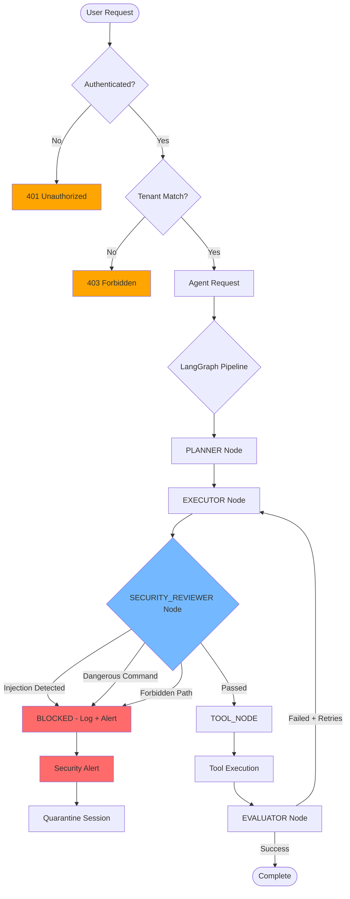

# OpenClaw Security Hardened Plan — NeureCore

**Document Version**: 1.1
**Created**: March 28, 2026
**Updated**: March 28, 2026 (Added SOLID Compliance)
**Status**: Draft for Review
**Author**: Ali (Architect Mode Analysis)

---

## SOLID Compliance Statement

This plan **fully adheres** to NeureCore's SOLID principles as defined in [`plans/solid_compliant_architecture_design.md`](plans/solid_compliant_architecture_design.md:1):

| Principle                 | Implementation                                         |
| ------------------------- | ------------------------------------------------------ |
| **S**ingle Responsibility | Each service has ONE reason to change                  |
| **O**pen/Closed           | Extend via interfaces, never modify existing modules   |
| **L**iskov Substitution   | Interface implementations are swappable                |
| **I**nterface Segregation | Small, focused interfaces (e.g., `ISecurityValidator`) |
| **D**ependency Inversion  | Depend on abstractions, not concretions                |

**Critical Rule from .clinerules**: Services must be **injected**, never instantiated manually.

---

## Executive Summary

This plan addresses the security hardening of NeureCore's AI agent infrastructure, specifically focusing on the OpenClaw integration within the context of your existing LangGraph-based agent execution pipeline. The plan takes an **"Incremental Security"** approach rather than a disruptive re-architecture.

### Key Principles

1. **No Major Re-architecture** — Build on existing `OfficialAgentGraph` and `StructuredToolRegistry`
2. **Defense in Depth** — Layer security at multiple points (gateway, graph, tool execution)
3. **Practical Over Perfect** — Immediate wins without requiring Docker/Alpha software adoption
4. **Future-Proof** — Create Policy documents that work with OpenClaw, NemoClaw, or any future framework

---

## Section 1: Current Architecture Analysis

### 1.1 Integration Points Identified

Based on code review of `backend/src/modules/`:

| Component                  | File                                                                                              | Security Relevance              |
| -------------------------- | ------------------------------------------------------------------------------------------------- | ------------------------------- |
| **OfficialAgentGraph**     | [`langgraph-official.ts`](backend/src/modules/agents/langgraph/langgraph-official.ts:1)           | 4-node LangGraph pipeline       |
| **StructuredToolRegistry** | [`structured-tool.registry.ts`](backend/src/modules/tools/structured-tool.registry.ts:1)          | Tool execution gateway          |
| **OpenClawGatewayService** | [`openclaw-gateway.service.ts`](backend/src/modules/ai-gateway/openclaw-gateway.service.ts:1)     | External AI agent communication |
| **AgentStreamingService**  | [`agent-streaming.service.ts`](backend/src/modules/agents/streaming/agent-streaming.service.ts:1) | SSE event streaming             |

### 1.2 LangGraph Pipeline Security Assessment

```
┌─────────────────────────────────────────────────────────────────────┐
│                    OfficialAgentGraph Pipeline                       │
├─────────────┬─────────────┬─────────────┬───────────────────────────┤
│   PLANNER   │  EXECUTOR   │  TOOL_NODE  │         EVALUATOR         │
│   (lines    │  (lines     │  (lines     │       (lines 375-434)     │
│   229-264)  │  270-302)   │  308-369)   │                           │
├─────────────┴─────────────┴─────────────┴───────────────────────────┤
│  ⚠️ TOOL_NODE is the PRIMARY security insertion point ⚠️            │
│                                                                     │
│  Security Interceptor Hook:                                         │
│  - Before: toolRegistry.get() + tool.execute() (line 328-340)       │
│  - Add: Command pattern validation + prompt injection detection      │
└─────────────────────────────────────────────────────────────────────┘
```

### 1.3 Threat Model

| Threat Vector                | Likelihood | Impact   | Primary Mitigation                     |
| ---------------------------- | ---------- | -------- | -------------------------------------- |
| **Prompt Injection**         | HIGH       | HIGH     | Input sanitization in TOOL_NODE        |
| **Malicious Commands**       | MEDIUM     | CRITICAL | Command pattern validation             |
| **API Key Exposure**         | LOW        | HIGH     | SecretRefs + Environment Variables     |
| **Cross-Tenant Data Access** | LOW        | CRITICAL | TenantId filters (already implemented) |
| **Gateway Token Theft**      | MEDIUM     | MEDIUM   | IP whitelist + Reverse Proxy           |
| **Agent Hallucination**      | MEDIUM     | MEDIUM   | LangGraph EVALUATOR + Policy docs      |

---

## Section 2: The Revised Agile Roadmap

### Phase Timeline

```
March 2026          April 2026           May 2026          Q3 2026          Q4 2026
     │                   │                   │                 │                 │
     ▼                   ▼                   ▼                 ▼                 ▼
┌─────────┐         ┌─────────┐         ┌─────────┐       ┌─────────┐      ┌─────────┐
│ Agent   │         │ LangGraph│         │Secret   │       │Container│      │ NemoClaw│
│ Policies│         │Security  │         │Refs     │       │ Adoption│      │Evaluation│
│ (IMMED)│         │Interceptor│        │Migration│       │         │      │          │
└─────────┘         └─────────┘         └─────────┘       └─────────┘      └─────────┘
```

---

## Phase 1: Agent Policy Documents (IMMEDIATE — This Week)

### 2.1 Why Start Here?

- **Zero code changes** — Pure documentation
- **Framework agnostic** — Works with OpenClaw, NemoClaw, or any future framework
- **Professional architecture** — Demonstrates enterprise-grade thinking
- **Low effort, high future value** — NemoClaw reads these natively

### 2.2 Policy Document Template Structure

```
docs/POLICIES/
├── README.md                          # Policy index + usage guide
├── _templates/
│   └── AGENT_POLICY_TEMPLATE.md       # Reusable template
├── FINANCE/
│   ├── finance-analyst.md
│   ├── financial-risk-analyst.md
│   └── audit-agent.md
├── OPERATIONS/
│   ├── supply-chain-specialist.md
│   └── logistics-coordinator.md
└── RISK_COMPLIANCE/
    ├── audit-compliance-officer.md
    └── governance-agent.md
```

### 2.3 Policy Document Template

```markdown
# {Agent Type} — Policy Document

**Version**: 1.0  
**Last Updated**: {Date}  
**Agent Type**: {Type}  
**Department**: {Department}

---

## 1. Role & Purpose

{Detailed description of the agent's role in the organization}

## 2. Allowed Actions

### 2.1 Approved Tools

- [ ] `tool.name` — Purpose and justification
- [ ] `tool.name` — Purpose and justification

### 2.2 Approved Data Access

- [ ] Read: {data_source}
- [ ] Write: {data_source}
- [ ] No access: {restricted_resource}

### 2.3 Approved Network Targets

- [ ] `{domain}` — For {purpose}
- [ ] `{domain}` — Blocked ❌

## 3. Forbidden Actions

### 3.1 Prohibited Commands

- `rm -rf /` — File deletion at root
- `chmod 777` — Permission escalation
- `> /etc/passwd` — System file manipulation
- Any command containing: `{dangerous_pattern}`

### 3.2 Prohibited Access

- `/admin` endpoints
- `/api/v1/tenants/{other_tenant_id}/*`
- Direct database manipulation

### 3.3 Prohibited Behaviors

- Executing code from untrusted sources
- Transmitting credentials in logs
- Accessing data outside assigned tenant

## 4. Input Validation Rules

### 4.1 Prompt Injection Detection

- Reject inputs containing: `<\|.*\|>`, ` Ignore previous instructions`
- Sanitize: `{special_characters}`

### 4.2 Command Validation

- Any shell command must pass regex: `^{safe_pattern}$`
- Blocklist: `rm`, `dd`, `mkfs`, `> /etc/`

## 5. Escalation Procedures

| Scenario                    | Action             | Contact       |
| --------------------------- | ------------------ | ------------- |
| Blocked command attempt     | Log + alert        | Security team |
| Prompt injection detected   | Quarantine session | Admin         |
| Cross-tenant access attempt | Immediate alert    | SOC           |

## 6. Compliance Mapping

| Regulation | Requirement          | Implementation     |
| ---------- | -------------------- | ------------------ |
| SOC 2      | Data isolation       | TenantId filtering |
| GDPR       | Access logging       | AuditInterceptor   |
| ISO 27001  | Asset classification | Policy enforcement |

---

**Reviewer**: {Name}  
**Approved**: {Yes/No}  
**Next Review**: {Date}
```

### 2.4 Deliverables

| Document                                                    | Status    | Priority |
| ----------------------------------------------------------- | --------- | -------- |
| `docs/POLICIES/README.md`                                   | ⬜ Create | HIGH     |
| `docs/POLICIES/_templates/AGENT_POLICY_TEMPLATE.md`         | ⬜ Create | HIGH     |
| `docs/POLICIES/FINANCE/finance-analyst.md`                  | ⬜ Create | HIGH     |
| `docs/POLICIES/OPERATIONS/supply-chain-specialist.md`       | ⬜ Create | MEDIUM   |
| `docs/POLICIES/RISK_COMPLIANCE/audit-compliance-officer.md` | ⬜ Create | MEDIUM   |

---

## Phase 2: LangGraph Security Interceptor (NEXT WEEK)

### 3.1 Architecture

Add a **SECURITY_REVIEWER** node to the existing LangGraph pipeline:

```
┌──────────────────────────────────────────────────────────────────────┐
│              Modified OfficialAgentGraph Pipeline                     │
├─────────────┬─────────────────┬─────────────┬───────────────────────┤
│   PLANNER   │   EXECUTOR      │ SECURITY_   │       TOOL_NODE       │
│             │                 │ REVIEWER    │                       │
│             │                 │ ⭐ NEW      │                       │
├─────────────┴─────────────────┴─────────────┴───────────────────────┤
│                                    │                                 │
│                         ┌──────────┴──────────┐                      │
│                         │                     │                      │
│                    PASS ✓                 FAIL ✗                      │
│                         │                     │                      │
│                         ▼                     ▼                      │
│                  ┌───────────┐         ┌───────────┐                │
│                  │TOOL_NODE  │         │  EVAL_    │                │
│                  │           │         │  REJECT   │                │
│                  └───────────┘         └───────────┘                │
└──────────────────────────────────────────────────────────────────────┘
```

### 3.2 SOLID-Compliant Interface Design

**Key Principle**: Interface Segregation — split into focused validators, injectable via NestJS DI.

#### 3.2.1 Interface Definitions

**File to Create**: `backend/src/modules/agents/security/interfaces/security.interfaces.ts`

```typescript
/**
 * Security Interfaces — SOLID: Interface Segregation
 *
 * Each interface has ONE responsibility, enabling swappable implementations.
 */

// ─────────────────────────────────────────────────────────────
// IPromptInjectionValidator — Single Responsibility
// ─────────────────────────────────────────────────────────────

export interface IPromptInjectionResult {
  detected: boolean;
  patterns: string[];
  sanitized?: Record<string, unknown>;
}

export interface IPromptInjectionValidator {
  /**
   * Detect prompt injection patterns in tool input
   * @param input - Tool call input to validate
   * @returns Detection result with matched patterns
   */
  detect(input: Record<string, unknown>): IPromptInjectionResult;

  /**
   * Sanitize input by removing injection patterns
   * @param input - Input to sanitize
   * @returns Sanitized input
   */
  sanitize(input: Record<string, unknown>): Record<string, unknown>;
}

// ─────────────────────────────────────────────────────────────
// ICommandPatternValidator — Single Responsibility
// ─────────────────────────────────────────────────────────────

export interface ICommandValidationResult {
  allowed: boolean;
  reason?: string;
  blockedPattern?: string;
}

export interface ICommandPatternValidator {
  /**
   * Validate shell command against allowlist/blocklist
   * @param command - Command string to validate
   * @returns Validation result
   */
  validate(command: string): ICommandValidationResult;

  /**
   * Check if this tool requires command validation
   * @param toolName - Name of the tool
   * @returns True if command validation needed
   */
  isShellTool(toolName: string): boolean;
}

// ─────────────────────────────────────────────────────────────
// IResourceAccessValidator — Single Responsibility
// ─────────────────────────────────────────────────────────────

export interface IResourceValidationResult {
  allowed: boolean;
  reason?: string;
  blockedPath?: string;
}

export interface IResourceAccessValidator {
  /**
   * Validate resource (file/path) access
   * @param resource - Path or resource identifier
   * @param context - Access context (read/write/execute)
   * @returns Validation result
   */
  validate(
    resource: string,
    context: "read" | "write" | "execute",
  ): IResourceValidationResult;
}

// ─────────────────────────────────────────────────────────────
// ISecurityPolicyProvider — Single Responsibility
// ─────────────────────────────────────────────────────────────

export interface ISecurityPolicy {
  agentType: string;
  allowedTools: string[];
  blockedTools: string[];
  allowedPaths: string[];
  blockedPaths: string[];
  allowedDomains: string[];
  blockedDomains: string[];
  maxFileSizeBytes: number;
}

export interface ISecurityPolicyProvider {
  /**
   * Get security policy for an agent type
   * @param agentType - Type of agent
   * @param tenantId - Tenant context
   * @returns Security policy or null if not found
   */
  getPolicy(
    agentType: string,
    tenantId: string,
  ): Promise<ISecurityPolicy | null>;

  /**
   * Validate a tool call against agent's policy
   * @param toolName - Tool being called
   * @param policy - Security policy to check against
   * @returns True if allowed
   */
  isToolAllowed(toolName: string, policy: ISecurityPolicy): boolean;
}

// ─────────────────────────────────────────────────────────────
// ISecurityInterceptor — Facade Interface
// ─────────────────────────────────────────────────────────────

export interface ISecurityValidationResult {
  allowed: boolean;
  reason?: string;
  sanitizedInput?: Record<string, unknown>;
  blockReason?:
    | "PROMPT_INJECTION"
    | "DANGEROUS_COMMAND"
    | "FORBIDDEN_RESOURCE"
    | "POLICY_VIOLATION";
}

export interface ISecurityInterceptor {
  /**
   * Full security validation of a tool call
   * @param toolName - Tool being called
   * @param input - Tool input
   * @param context - Security context (tenant, agent type)
   * @returns Complete validation result
   */
  validate(
    toolName: string,
    input: Record<string, unknown>,
    context: { tenantId: string; agentType?: string },
  ): Promise<ISecurityValidationResult>;
}
```

#### 3.2.2 Concrete Implementations (All use NestJS DI)

**File to Create**: `backend/src/modules/agents/security/validators/prompt-injection.validator.ts`

```typescript
/**
 * Prompt Injection Validator
 *
 * SOLID: Single Responsibility — ONLY handles prompt injection detection
 * SOLID: Open/Closed — Add new patterns via configuration, not code changes
 */

import { Injectable, Logger } from "@nestjs/common";
import {
  IPromptInjectionValidator,
  IPromptInjectionResult,
} from "../interfaces/security.interfaces";

@Injectable()
export class PromptInjectionValidator implements IPromptInjectionValidator {
  private readonly logger = new Logger(PromptInjectionValidator.name);

  // Configurable patterns (could be loaded from ConfigService)
  private readonly INJECTION_PATTERNS: RegExp[] = [
    /<\|.*?\|>/g, // Generic instruction override
    /ignore previous instructions/gi,
    /ignore all previous instructions/gi,
    /disregard.*instructions/gi,
  ];

  detect(input: Record<string, unknown>): IPromptInjectionResult {
    const stringValues = this.extractStringValues(input);
    const matchedPatterns: string[] = [];

    for (const value of stringValues) {
      for (const pattern of this.INJECTION_PATTERNS) {
        if (pattern.test(value)) {
          matchedPatterns.push(pattern.source);
        }
      }
    }

    return {
      detected: matchedPatterns.length > 0,
      patterns: matchedPatterns,
    };
  }

  sanitize(input: Record<string, unknown>): Record<string, unknown> {
    const sanitized = { ...input };

    for (const key of Object.keys(sanitized)) {
      if (typeof sanitized[key] === "string") {
        // Remove null bytes
        sanitized[key] = sanitized[key].replace(/\0/g, "");
      }
    }

    return sanitized;
  }

  private extractStringValues(obj: Record<string, unknown>): string[] {
    const strings: string[] = [];

    for (const value of Object.values(obj)) {
      if (typeof value === "string") {
        strings.push(value);
      } else if (Array.isArray(value)) {
        strings.push(
          ...(value.filter((v) => typeof v === "string") as string[]),
        );
      } else if (typeof value === "object" && value !== null) {
        strings.push(
          ...this.extractStringValues(value as Record<string, unknown>),
        );
      }
    }

    return strings;
  }
}
```

**File to Create**: `backend/src/modules/agents/security/validators/command-pattern.validator.ts`

```typescript
/**
 * Command Pattern Validator
 *
 * SOLID: Single Responsibility — ONLY validates shell commands
 * SOLID: Dependency Inversion — Depends on interface, not implementation
 */

import { Injectable, Logger } from "@nestjs/common";
import {
  ICommandPatternValidator,
  ICommandValidationResult,
} from "../interfaces/security.interfaces";

@Injectable()
export class CommandPatternValidator implements ICommandPatternValidator {
  private readonly logger = new Logger(CommandPatternValidator.name);

  // Dangerous patterns — could be loaded from config
  private readonly BLOCKED_PATTERNS: RegExp[] = [
    /^rm\s+-rf\s+\//, // Recursive root delete
    /^dd\s+/, // Direct disk write
    /^mkfs/, // Filesystem format
    />\s*\/etc\//, // Writing to /etc
    /chmod\s+777/, // Permission escalation
    /^wget.*\|\s*sh/, // Remote code download
    /^curl.*\|\s*sh/, // Remote code download
  ];

  // Tools that involve command execution
  private readonly SHELL_TOOLS = [
    "bash",
    "shell",
    "exec",
    "run",
    "command",
    "script",
  ];

  validate(command: string): ICommandValidationResult {
    for (const pattern of this.BLOCKED_PATTERNS) {
      if (pattern.test(command)) {
        this.logger.warn(
          `Blocked dangerous command: ${command.substring(0, 50)}...`,
        );
        return {
          allowed: false,
          reason: `Dangerous command pattern blocked`,
          blockedPattern: pattern.source,
        };
      }
    }

    return { allowed: true };
  }

  isShellTool(toolName: string): boolean {
    const lower = toolName.toLowerCase();
    return this.SHELL_TOOLS.some((t) => lower.includes(t));
  }
}
```

**File to Create**: `backend/src/modules/agents/security/validators/resource-access.validator.ts`

```typescript
/**
 * Resource Access Validator
 *
 * SOLID: Single Responsibility — ONLY validates resource paths
 */

import { Injectable, Logger } from "@nestjs/common";
import {
  IResourceAccessValidator,
  IResourceValidationResult,
} from "../interfaces/security.interfaces";

@Injectable()
export class ResourceAccessValidator implements IResourceAccessValidator {
  private readonly logger = new Logger(ResourceAccessValidator.name);

  // Forbidden paths regardless of context
  private readonly FORBIDDEN_PATHS: RegExp[] = [
    /^\/root\//,
    /^\/etc\/passwd/,
    /^\/etc\/shadow/,
    /^\/var\/log\/.*\.log$/,
    /^\/\.ssh\//,
    /^\/\.aws\//,
  ];

  // Write-sensitive paths
  private readonly WRITE_SENSITIVE_PATHS: RegExp[] = [
    /^\/etc\//,
    /^\/bin\//,
    /^\/usr\/bin\//,
    /^\/sbin\//,
  ];

  validate(
    resource: string,
    context: "read" | "write" | "execute",
  ): IResourceValidationResult {
    // Check absolute forbidden paths
    for (const pattern of this.FORBIDDEN_PATHS) {
      if (pattern.test(resource)) {
        return {
          allowed: false,
          reason: `Forbidden path: ${resource}`,
          blockedPath: resource,
        };
      }
    }

    // Additional checks for write context
    if (context === "write") {
      for (const pattern of this.WRITE_SENSITIVE_PATHS) {
        if (pattern.test(resource)) {
          return {
            allowed: false,
            reason: `Write to sensitive path not allowed: ${resource}`,
            blockedPath: resource,
          };
        }
      }
    }

    return { allowed: true };
  }
}
```

**File to Create**: `backend/src/modules/agents/security/providers/security-policy.provider.ts`

```typescript
/**
 * Security Policy Provider
 *
 * SOLID: Single Responsibility — ONLY loads and provides security policies
 * SOLID: Open/Closed — Policies loaded from external source (could be DB, file, etc.)
 */

import { Injectable, Logger } from "@nestjs/common";
import {
  ISecurityPolicyProvider,
  ISecurityPolicy,
} from "../interfaces/security.interfaces";
import * as fs from "fs";
import * as path from "path";

@Injectable()
export class SecurityPolicyProvider implements ISecurityPolicyProvider {
  private readonly logger = new Logger(SecurityPolicyProvider.name);
  private readonly policyCache = new Map<
    string,
    { policy: ISecurityPolicy; loadedAt: number }
  >();
  private readonly CACHE_TTL_MS = 5 * 60 * 1000; // 5 minutes

  async getPolicy(
    agentType: string,
    tenantId: string,
  ): Promise<ISecurityPolicy | null> {
    const cacheKey = `${tenantId}:${agentType}`;
    const cached = this.policyCache.get(cacheKey);

    if (cached && cached.loadedAt + this.CACHE_TTL_MS > Date.now()) {
      return cached.policy;
    }

    // Load from file (could be replaced with DB call)
    const policy = await this.loadPolicyFromFile(agentType);

    if (policy) {
      this.policyCache.set(cacheKey, { policy, loadedAt: Date.now() });
    }

    return policy;
  }

  isToolAllowed(toolName: string, policy: ISecurityPolicy): boolean {
    // Explicit blocklist takes precedence
    if (policy.blockedTools.includes(toolName)) {
      return false;
    }

    // If allowlist is empty, allow all (except blocked)
    if (policy.allowedTools.length === 0) {
      return true;
    }

    // Check allowlist
    return policy.allowedTools.includes(toolName);
  }

  private async loadPolicyFromFile(
    agentType: string,
  ): Promise<ISecurityPolicy | null> {
    const policyPath = path.join(
      process.cwd(),
      "docs",
      "POLICIES",
      `${agentType}.json`,
    );

    try {
      if (fs.existsSync(policyPath)) {
        const content = fs.readFileSync(policyPath, "utf-8");
        return JSON.parse(content) as ISecurityPolicy;
      }
    } catch (error) {
      this.logger.warn(`Failed to load policy for ${agentType}: ${error}`);
    }

    // Return default restrictive policy
    return {
      agentType,
      allowedTools: [],
      blockedTools: ["shell", "bash", "exec", "rm", "dd", "mkfs"],
      allowedPaths: ["/workspace"],
      blockedPaths: ["/etc", "/root", "/bin", "/sbin"],
      allowedDomains: [],
      blockedDomains: ["*"],
      maxFileSizeBytes: 10 * 1024 * 1024, // 10MB
    };
  }
}
```

**File to Create**: `backend/src/modules/agents/security/security-interceptor.service.ts`

```typescript
/**
 * Security Interceptor Service — Facade
 *
 * SOLID: Facade Pattern — Coordinates multiple validators
 * SOLID: Dependency Inversion — Depends on interfaces, not implementations
 *
 * IMPORTANT: This service is INJECTED into OfficialAgentGraph, never instantiated manually.
 */

import { Injectable, Logger } from "@nestjs/common";
import {
  ISecurityInterceptor,
  ISecurityValidationResult,
  IPromptInjectionValidator,
  ICommandPatternValidator,
  IResourceAccessValidator,
  ISecurityPolicyProvider,
} from "./interfaces/security.interfaces";

@Injectable()
export class SecurityInterceptorService implements ISecurityInterceptor {
  private readonly logger = new Logger(SecurityInterceptorService.name);

  constructor(
    // ✅ INJECTED via NestJS DI — never instantiated manually
    private readonly promptValidator: IPromptInjectionValidator,
    private readonly commandValidator: ICommandPatternValidator,
    private readonly resourceValidator: IResourceAccessValidator,
    private readonly policyProvider: ISecurityPolicyProvider,
  ) {}

  async validate(
    toolName: string,
    input: Record<string, unknown>,
    context: { tenantId: string; agentType?: string },
  ): Promise<ISecurityValidationResult> {
    this.logger.debug(`[Security] Validating tool call: ${toolName}`);

    // Step 1: Policy check (if agent type known)
    if (context.agentType) {
      const policy = await this.policyProvider.getPolicy(
        context.agentType,
        context.tenantId,
      );
      if (policy && !this.policyProvider.isToolAllowed(toolName, policy)) {
        this.logger.warn(`[Security] Tool ${toolName} not allowed by policy`);
        return {
          allowed: false,
          blockReason: "POLICY_VIOLATION",
          reason: `Tool '${toolName}' is not permitted for agent type '${context.agentType}'`,
        };
      }
    }

    // Step 2: Prompt injection detection
    const injectionResult = this.promptValidator.detect(input);
    if (injectionResult.detected) {
      this.logger.warn(
        `[Security] Prompt injection detected: ${injectionResult.patterns.join(", ")}`,
      );
      return {
        allowed: false,
        blockReason: "PROMPT_INJECTION",
        reason: `Prompt injection detected: ${injectionResult.patterns.join(", ")}`,
      };
    }

    // Step 3: Command validation (for shell tools)
    if (this.commandValidator.isShellTool(toolName)) {
      const command = input.command || input.cmd || input.shell;
      if (typeof command === "string") {
        const cmdResult = this.commandValidator.validate(command);
        if (!cmdResult.allowed) {
          return {
            allowed: false,
            blockReason: "DANGEROUS_COMMAND",
            reason: cmdResult.reason,
          };
        }
      }
    }

    // Step 4: Resource access validation
    const resource = input.path || input.file || input.directory;
    if (typeof resource === "string") {
      const context_type =
        (input._context as "read" | "write" | "execute") || "read";
      const resourceResult = this.resourceValidator.validate(
        resource,
        context_type,
      );
      if (!resourceResult.allowed) {
        return {
          allowed: false,
          blockReason: "FORBIDDEN_RESOURCE",
          reason: resourceResult.reason,
        };
      }
    }

    // Step 5: Sanitize and pass through
    const sanitized = this.promptValidator.sanitize(input);

    this.logger.debug(`[Security] Tool ${toolName} passed validation`);

    return {
      allowed: true,
      sanitizedInput: sanitized,
    };
  }
}
```

#### 3.2.3 Module Registration

**File to Create**: `backend/src/modules/agents/security/security.module.ts`

```typescript
/**
 * Security Module — NestJS DI Configuration
 *
 * SOLID: Dependency Inversion — Module provides interfaces bound to implementations
 */

import { Module } from "@nestjs/common";
import { SecurityInterceptorService } from "./security-interceptor.service";
import { PromptInjectionValidator } from "./validators/prompt-injection.validator";
import { CommandPatternValidator } from "./validators/command-pattern.validator";
import { ResourceAccessValidator } from "./validators/resource-access.validator";
import { SecurityPolicyProvider } from "./providers/security-policy.provider";
import { ISecurityInterceptor } from "./interfaces/security.interfaces";

@Module({
  providers: [
    // Validators
    PromptInjectionValidator,
    CommandPatternValidator,
    ResourceAccessValidator,

    // Policy Provider
    SecurityPolicyProvider,

    // Main Interceptor (Facade)
    {
      provide: ISecurityInterceptor,
      useClass: SecurityInterceptorService,
    },
  ],
  exports: [ISecurityInterceptor],
})
export class SecurityModule {}
```

#### 3.2.4 Integration with OfficialAgentGraph

**File to Modify**: `backend/src/modules/agents/langgraph/langgraph-official.ts`

```typescript
// ❌ WRONG — Never instantiate manually
import { SecurityInterceptorService } from "./security/security-interceptor.service";

// ✅ CORRECT — Import interface only
import { ISecurityInterceptor } from "./security/interfaces/security.interfaces";

@Injectable()
export class OfficialAgentGraph {
  constructor(
    private readonly config: ConfigService,
    private readonly streamingService: AgentStreamingService,
    private readonly toolRegistry: StructuredToolRegistry,
    private readonly checkpointService: AgentCheckpointService,
    // ✅ INJECTED via NestJS DI
    private readonly securityInterceptor: ISecurityInterceptor,
  ) {
    this.initializeGraph();
  }

  // In securityReviewerNode method:
  private securityReviewerNode: AgentNodeFunction = async (state) => {
    const currentStep = state.currentStep;
    if (!currentStep || !currentStep.toolId) {
      return { currentNode: TOOL_NODE };
    }

    // ✅ Use injected interceptor
    const validation = await this.securityInterceptor.validate(
      currentStep.toolId,
      currentStep.input,
      {
        tenantId: state.tenantId,
        agentType: "default", // Would come from agent config
      },
    );

    if (!validation.allowed) {
      return {
        error: validation.reason,
        shouldContinue: false,
        currentNode: SECURITY_REVIEWER_NODE,
      };
    }

    return {
      currentStep: {
        ...currentStep,
        input: validation.sanitizedInput || currentStep.input,
      },
      currentNode: SECURITY_REVIEWER_NODE,
    };
  };
}
```

### 3.3 File Structure Summary

```
backend/src/modules/agents/security/
├── interfaces/
│   └── security.interfaces.ts     # ALL interface definitions
├── validators/
│   ├── prompt-injection.validator.ts      # IPromptInjectionValidator impl
│   ├── command-pattern.validator.ts       # ICommandPatternValidator impl
│   └── resource-access.validator.ts       # IResourceAccessValidator impl
├── providers/
│   └── security-policy.provider.ts        # ISecurityPolicyProvider impl
├── security-interceptor.service.ts        # ISecurityInterceptor impl (Facade)
└── security.module.ts                     # NestJS DI configuration
```

### 3.4 SOLID Compliance Verification

| Principle                 | Implementation                           | Verified |
| ------------------------- | ---------------------------------------- | -------- |
| **S**ingle Responsibility | Each validator has ONE job               | ✅       |
| **O**pen/Closed           | Add patterns via config, not code        | ✅       |
| **L**iskov Substitution   | Swappable implementations via interfaces | ✅       |
| **I**nterface Segregation | Small focused interfaces (4 validators)  | ✅       |
| **D**ependency Inversion  | All services injected via NestJS DI      | ✅       |

### 3.2 Implementation Details (Legacy — DEPRECATED)

**⚠️ This section is DEPRECATED. Use the SOLID-compliant design above.**

**File to Create**: `backend/src/modules/agents/security/security-interceptor.service.ts`

```typescript
/**
 * Security Interceptor Service
 *
 * Validates tool calls BEFORE execution in the LangGraph TOOL_NODE.
 * Implements prompt injection detection and command pattern validation.
 */

import { Injectable, Logger } from "@nestjs/common";

export interface SecurityValidationResult {
  allowed: boolean;
  reason?: string;
  sanitizedInput?: Record<string, unknown>;
  blockReason?: "PROMPT_INJECTION" | "DANGEROUS_COMMAND" | "FORBIDDEN_RESOURCE";
}

@Injectable()
export class SecurityInterceptorService {
  private readonly logger = new Logger(SecurityInterceptorService.name);

  // Prompt injection patterns
  private readonly INJECTION_PATTERNS = [
    /<\|.*?\|>/g, // Generic instruction override
    /ignore previous instructions/gi,
    /ignore all previous instructions/gi,
    /disregard.*instructions/gi,
  ];

  // Dangerous command patterns
  private readonly DANGEROUS_COMMANDS = [
    /^rm\s+-rf\s+\//, // Recursive root delete
    /^dd\s+/, // Direct disk write
    /^mkfs/, // Filesystem format
    />\s*\/etc\//, // Writing to /etc
    /chmod\s+777/, // Permission escalation
    /^wget.*\|\s*sh/, // Remote code download
    /^curl.*\|\s*sh/, // Remote code download
  ];

  // Forbidden resource patterns
  private readonly FORBIDDEN_PATHS = [
    /^\/root\//,
    /^\/etc\/passwd/,
    /^\/etc\/shadow/,
    /^\/var\/log\/.*\.log$/,
  ];

  /**
   * Validate a tool call before execution
   */
  validateToolCall(
    toolName: string,
    input: Record<string, unknown>,
    context: {
      tenantId: string;
      agentType?: string;
      policyDoc?: string;
    },
  ): SecurityValidationResult {
    // Step 1: Check for prompt injection in string inputs
    const injectionResult = this.detectPromptInjection(input);
    if (injectionResult.blocked) {
      this.logger.warn(`[Security] Prompt injection detected in ${toolName}`, {
        tenantId: context.tenantId,
        pattern: injectionResult.pattern,
      });
      return {
        allowed: false,
        blockReason: "PROMPT_INJECTION",
        reason: `Prompt injection detected: ${injectionResult.pattern}`,
      };
    }

    // Step 2: Validate shell commands (if tool involves command execution)
    if (this.isShellTool(toolName)) {
      const commandValidation = this.validateShellCommand(input);
      if (!commandValidation.allowed) {
        this.logger.warn(
          `[Security] Dangerous command blocked in ${toolName}`,
          {
            tenantId: context.tenantId,
            reason: commandValidation.reason,
          },
        );
        return {
          allowed: false,
          blockReason: "DANGEROUS_COMMAND",
          reason: commandValidation.reason,
        };
      }
    }

    // Step 3: Validate resource access
    const resourceValidation = this.validateResourceAccess(input);
    if (!resourceValidation.allowed) {
      this.logger.warn(`[Security] Forbidden resource access in ${toolName}`, {
        tenantId: context.tenantId,
        reason: resourceValidation.reason,
      });
      return {
        allowed: false,
        blockReason: "FORBIDDEN_RESOURCE",
        reason: resourceValidation.reason,
      };
    }

    // Step 4: Apply input sanitization
    const sanitized = this.sanitizeInput(input);

    return {
      allowed: true,
      sanitizedInput: sanitized,
    };
  }

  private detectPromptInjection(input: Record<string, unknown>): {
    blocked: boolean;
    pattern?: string;
  } {
    const stringInputs = this.extractStringValues(input);

    for (const value of stringInputs) {
      for (const pattern of this.INJECTION_PATTERNS) {
        if (pattern.test(value)) {
          return { blocked: true, pattern: pattern.source };
        }
      }
    }

    return { blocked: false };
  }

  private validateShellCommand(
    input: Record<string, unknown>,
  ): SecurityValidationResult {
    const command = input.command || input.cmd || input.shell;

    if (typeof command !== "string") {
      return { allowed: true };
    }

    for (const pattern of this.DANGEROUS_COMMANDS) {
      if (pattern.test(command)) {
        return {
          allowed: false,
          reason: `Dangerous command pattern blocked: ${pattern.source}`,
        };
      }
    }

    return { allowed: true };
  }

  private validateResourceAccess(
    input: Record<string, unknown>,
  ): SecurityValidationResult {
    const path = input.path || input.file || input.directory;

    if (typeof path !== "string") {
      return { allowed: true };
    }

    for (const pattern of this.FORBIDDEN_PATHS) {
      if (pattern.test(path)) {
        return {
          allowed: false,
          reason: `Forbidden path access: ${path}`,
        };
      }
    }

    return { allowed: true };
  }

  private sanitizeInput(
    input: Record<string, unknown>,
  ): Record<string, unknown> {
    const sanitized = { ...input };

    // Remove null bytes
    for (const key of Object.keys(sanitized)) {
      if (typeof sanitized[key] === "string") {
        sanitized[key] = sanitized[key].replace(/\0/g, "");
      }
    }

    return sanitized;
  }

  private extractStringValues(obj: Record<string, unknown>): string[] {
    const strings: string[] = [];

    for (const value of Object.values(obj)) {
      if (typeof value === "string") {
        strings.push(value);
      } else if (Array.isArray(value)) {
        strings.push(
          ...(value.filter((v) => typeof v === "string") as string[]),
        );
      } else if (typeof value === "object" && value !== null) {
        strings.push(
          ...this.extractStringValues(value as Record<string, unknown>),
        );
      }
    }

    return strings;
  }

  private isShellTool(toolName: string): boolean {
    const shellTools = ["bash", "shell", "exec", "run", "command"];
    return shellTools.some((t) => toolName.toLowerCase().includes(t));
  }
}
```

### 3.3 Integration with OfficialAgentGraph

**File to Modify**: [`langgraph-official.ts`](backend/src/modules/agents/langgraph/langgraph-official.ts:1)

Add a new node and integrate the interceptor:

```typescript
// Add to node name constants (line 23-27)
const SECURITY_REVIEWER_NODE = "security_reviewer";
const REJECT_NODE = "reject";

// In buildGraph() method (after line 182)
workflow.addNode(SECURITY_REVIEWER_NODE, this.securityReviewerNode.bind(this));
workflow.addNode(REJECT_NODE, this.rejectNode.bind(this));

// Modify edge: EXECUTOR -> SECURITY_REVIEWER (instead of direct TOOL_NODE)
workflow.addEdge(EXECUTOR_NODE as any, SECURITY_REVIEWER_NODE as any);

// Add conditional edge after security review
workflow.addConditionalEdges(
  SECURITY_REVIEWER_NODE as any,
  this.isSecurityApproved.bind(this),
  {
    tool_node: TOOL_NODE,
    reject: REJECT_NODE,
  } as any,
);

// Add edges to end
workflow.addEdge(REJECT_NODE as any, END as any);
```

Add the new node methods:

```typescript
private securityReviewerNode: AgentNodeFunction = async (state) => {
  this.logger.debug(`[security_reviewer] Validating tool calls`);

  const currentStep = state.currentStep;
  if (!currentStep || !currentStep.toolId) {
    return { currentNode: TOOL_NODE };
  }

  const validation = this.securityInterceptor.validateToolCall(
    currentStep.toolId,
    currentStep.input,
    {
      tenantId: state.tenantId,
      agentType: 'default', // Would come from agent config
    },
  );

  if (!validation.allowed) {
    this.logger.warn(`[security_reviewer] Blocked: ${validation.reason}`);
    return {
      error: validation.reason,
      toolResults: [{
        toolName: currentStep.toolId,
        input: currentStep.input,
        output: null,
        error: validation.reason,
        durationMs: 0,
      }],
      shouldContinue: false,
      currentNode: SECURITY_REVIEWER_NODE,
    };
  }

  // Pass through to TOOL_NODE with sanitized input
  return {
    currentStep: {
      ...currentStep,
      input: validation.sanitizedInput || currentStep.input,
    },
    currentNode: SECURITY_REVIEWER_NODE,
  };
};

private rejectNode: AgentNodeFunction = async (state) => {
  return {
    error: 'Security validation failed',
    shouldContinue: false,
    currentNode: REJECT_NODE,
  };
};

private isSecurityApproved(state: AgentGraphState): string {
  if (state.error && state.error.includes('Security validation failed')) {
    return 'reject';
  }
  return 'tool_node';
}
```

### 3.4 Deliverables

| Task                                    | File                                   | Status |
| --------------------------------------- | -------------------------------------- | ------ |
| Create SecurityInterceptorService       | `security-interceptor.service.ts`      | ⬜     |
| Integrate with OfficialAgentGraph       | `langgraph-official.ts`                | ⬜     |
| Add unit tests                          | `security-interceptor.service.spec.ts` | ⬜     |
| Update TOOL_NODE to use sanitized input | `langgraph-official.ts`                | ⬜     |

---

## Phase 3: SecretRefs & Environment Variable Migration (NEXT MONTH)

### 4.0 SOLID-Compliant Secret Management Design

**Key Principle**: All secret access goes through centralized `ISecretProvider` interface.

```typescript
// ❌ WRONG — Direct ConfigService usage everywhere
const apiKey = config.get('OPENCLAW_API_KEY');

// ✅ CORRECT — Centralized ISecretProvider (injected via DI)
constructor(private readonly secrets: ISecretProvider) {}
const apiKey = this.secrets.getOpenClawApiKey();
```

### 4.1 Current State

From `backend/.env.production` (as documented in memory-bank):

```env
MIMO_API_KEY=your-mimo-api-key
OPENCLAW_API_KEY=your-openclaw-api-key
JWT_SECRET=secure-secret-key-min-32-chars
DATABASE_URL=postgresql://...
REDIS_URL=redis://...
```

### 4.2 Issues Identified

1. **Hardcoded in config objects** — API keys may be in `ConfigService` usage
2. **Scattered across modules** — Each LLM client may have its own key handling
3. **No secret rotation support** — Hard to rotate without redeploy

### 4.3 SOLID-Compliant Interface Design

**File to Create**: `backend/src/modules/security/interfaces/secret.interfaces.ts`

```typescript
/**
 * Secret Interfaces — SOLID: Interface Segregation
 *
 * Single responsibility interfaces for secret management.
 */

export interface ISecretResult {
  value: string;
  expiresAt?: number;
  source: "env" | "vault" | "cache";
}

export interface ISecretProvider {
  /**
   * Resolve a secret reference
   * @param ref - Secret reference (e.g., 'env:OPENCLAW_API_KEY')
   */
  resolve(ref: string): ISecretResult;

  getOpenClawApiKey(): string;
  getJwtSecret(): string;
  getMiniMaxApiKey(): string;
  getDeepSeekApiKey(): string;
  getMimoApiKey(): string;
}

export interface ISecretRotator {
  rotate(secretName: string, newValue: string): Promise<void>;
}
```

**File to Create**: `backend/src/modules/security/providers/secret.provider.ts`

```typescript
/**
 * Secret Provider Service
 *
 * SOLID: Single Responsibility — ONLY provides secret access
 * SOLID: Open/Closed — Add new secret types via interface extension
 *
 * Uses NestJS DI to inject ConfigService
 */

import { Injectable, Logger } from "@nestjs/common";
import { ConfigService } from "@nestjs/config";
import {
  ISecretProvider,
  ISecretResult,
} from "../interfaces/secret.interfaces";

@Injectable()
export class SecretProviderService implements ISecretProvider {
  private readonly logger = new Logger(SecretProviderService.name);
  private readonly cache = new Map<
    string,
    { value: string; expiresAt: number }
  >();
  private readonly CACHE_TTL_MS = 5 * 60 * 1000;

  constructor(private readonly config: ConfigService) {}

  resolve(ref: string): ISecretResult {
    const cached = this.cache.get(ref);
    if (cached && cached.expiresAt > Date.now()) {
      return { ...cached, source: "cache" };
    }

    let value: string;
    let source: "env" | "vault" = "env";

    if (ref.startsWith("env:")) {
      const envVar = ref.substring(4);
      value = this.config.get<string>(envVar) || process.env[envVar] || "";
    } else {
      value = this.config.get<string>(ref) || process.env[ref] || "";
    }

    this.cache.set(ref, { value, expiresAt: Date.now() + this.CACHE_TTL_MS });

    return { value, source };
  }

  getOpenClawApiKey(): string {
    return this.resolve("env:OPENCLAW_API_KEY").value;
  }

  getJwtSecret(): string {
    return this.resolve("env:JWT_SECRET").value;
  }

  getMiniMaxApiKey(): string {
    return this.resolve("env:MINIMAX_API_KEY").value;
  }

  getDeepSeekApiKey(): string {
    return this.resolve("env:DEEPSEEK_API_KEY").value;
  }

  getMimoApiKey(): string {
    return this.resolve("env:MIMO_API_KEY").value;
  }
}
```

### 4.4 Migration Plan

#### Step 1: Audit Current Secret Usage

```bash
# Find potential hardcoded secrets
grep -r "api_key\|API_KEY\|secret\|SECRET" \
  --include="*.ts" \
  backend/src/modules/ \
  | grep -v "\.spec\.ts" \
  | grep -v "interface" \
  | grep -v "type.*="
```

#### Step 2: Create Centralized Secret Service

**File to Create**: `backend/src/modules/security/secret-manager.service.ts`

```typescript
/**
 * Secret Manager Service
 *
 * Centralized secret management with support for:
 * - Environment variable resolution
 * - Secret rotation preparation
 * - Audit logging for secret access
 */

import { Injectable, Logger } from "@nestjs/common";
import { ConfigService } from "@nestjs/config";

@Injectable()
export class SecretManagerService {
  private readonly logger = new Logger(SecretManagerService.name);

  // Cache for resolved secrets (with TTL for rotation)
  private readonly secretCache = new Map<
    string,
    { value: string; expiresAt: number }
  >();
  private readonly CACHE_TTL_MS = 5 * 60 * 1000; // 5 minutes

  constructor(private readonly config: ConfigService) {}

  /**
   * Resolve a secret reference
   * Supports: env:VAR_NAME, static:value
   */
  resolveSecret(ref: string): string {
    // Check cache
    const cached = this.secretCache.get(ref);
    if (cached && cached.expiresAt > Date.now()) {
      return cached.value;
    }

    let value: string;

    if (ref.startsWith("env:")) {
      const envVar = ref.substring(4);
      value = this.config.get<string>(envVar) || process.env[envVar] || "";
    } else if (ref.startsWith("static:")) {
      value = ref.substring(7);
    } else {
      // Treat as environment variable by default
      value = this.config.get<string>(ref) || process.env[ref] || "";
    }

    if (!value) {
      this.logger.warn(`Secret reference '${ref}' resolved to empty value`);
    }

    // Cache the result
    this.secretCache.set(ref, {
      value,
      expiresAt: Date.now() + this.CACHE_TTL_MS,
    });

    return value;
  }

  /**
   * Get OpenClaw API Key
   */
  getOpenClawApiKey(): string {
    return this.resolveSecret("env:OPENCLAW_API_KEY");
  }

  /**
   * Get JWT Secret
   */
  getJwtSecret(): string {
    return this.resolveSecret("env:JWT_SECRET");
  }

  /**
   * Get LLM API Keys
   */
  getMiniMaxApiKey(): string {
    return this.resolveSecret("env:MINIMAX_API_KEY");
  }

  getDeepSeekApiKey(): string {
    return this.resolveSecret("env:DEEPSEEK_API_KEY");
  }

  getMimoApiKey(): string {
    return this.resolveSecret("env:MIMO_API_KEY");
  }
}
```

#### Step 3: Migrate Existing Configurations

Update the following files to use SecretManagerService:

| File                          | Current Pattern              | Target Pattern                             |
| ----------------------------- | ---------------------------- | ------------------------------------------ |
| `openclaw-gateway.service.ts` | `@Inject('OPENCLAW_CONFIG')` | `SecretManagerService.getOpenClawApiKey()` |
| `llm-factory.service.ts`      | Direct env access            | `SecretManagerService` injection           |
| `auth.service.ts`             | `config.get('JWT_SECRET')`   | `SecretManagerService.getJwtSecret()`      |

### 4.4 Deliverables

| Task                              | Status |
| --------------------------------- | ------ |
| Audit current secret usage        | ⬜     |
| Create SecretManagerService       | ⬜     |
| Migrate OpenClaw config           | ⬜     |
| Migrate LLM client configs        | ⬜     |
| Migrate Auth module               | ⬜     |
| Document migration in memory-bank | ⬜     |

---

## Phase 4: Network Isolation — Reverse Proxy Enhancement (ONGOING)

### 5.1 Current Setup

From memory-bank:

- **Backend**: Contabo VPS (109.123.248.253) on port 3003
- **Nginx**: Reverse proxy configured for `api.neurecore.com`
- **CORS**: Allows `https://hq.neurecore.com`, `https://cc.neurecore.com`

### 5.2 Recommended Enhancements

#### Step 1: IP Whitelisting for OpenClaw Gateway

```nginx
# /etc/nginx/sites-available/neurecore

server {
    listen 80;
    server_name brain.neurecore.com;

    # IP whitelist for agent endpoints
    location /api/v1/agents/ {
        # Vercel's IP ranges (verify current ranges)
        allow 76.76.21.0/24;
        allow 76.76.19.0/24;
        deny all;

        proxy_pass http://127.0.0.1:3003;
        proxy_http_version 1.1;
        proxy_set_header Upgrade $http_upgrade;
        proxy_set_header Connection 'upgrade';
        proxy_set_header Host $host;
    }

    # Standard endpoints remain open for frontend
    location /api/v1/ {
        proxy_pass http://127.0.0.1:3003;
        # ... standard proxy config
    }
}
```

#### Step 2: API Key Header Validation

Add middleware to validate `X-OpenClaw-Token` header:

```typescript
// backend/src/modules/ai-gateway/middleware/openclaw-auth.middleware.ts

@Injectable()
export class OpenClawAuthMiddleware implements NestMiddleware {
  constructor(private readonly secretManager: SecretManagerService) {}

  use(req: Request, res: Response, next: NextFunction) {
    // Only apply to agent execution endpoints
    if (!req.path.startsWith("/api/v1/agents/")) {
      return next();
    }

    const token = req.headers["x-openclaw-token"];
    const expectedToken = this.secretManager.getOpenClawApiKey();

    if (!token || token !== expectedToken) {
      return res.status(401).json({
        success: false,
        error: "Invalid OpenClaw token",
      });
    }

    next();
  }
}
```

### 5.3 NOT Recommended (At This Time)

| Recommendation        | Why                                                         | When Revisit |
| --------------------- | ----------------------------------------------------------- | ------------ |
| **Tailscale Sidecar** | Adds networking complexity without addressing actual threat | Q4 2026      |
| **Cloudflare Tunnel** | Overkill for single-server setup                            | Q4 2026      |
| **Force Docker**      | Current host-based deployment is stable                     | Q3 2026      |

---

## Phase 5: Low-Privilege User Isolation (NEXT MONTH — Low Priority)

### 6.1 Current State

- Backend runs under **root** or **unknown user**
- Agent workspace: `/opt/neurecore/agent-workspace` (if exists)
- No user namespace isolation

### 6.2 Recommended Approach (No Docker)

```bash
# Create dedicated worker user
sudo useradd -r -s /bin/false neure-worker

# Set up workspace directory
sudo mkdir -p /opt/neurecore/agent-workspace
sudo chown -R neure-worker:neure-worker /opt/neurecore/agent-workspace

# Update PM2 to run as neure-worker
pm2 stop neurecore-backend
sudo -u neure-worker pm2 start ecosystem.config.js --env production
```

### 6.3 Security Boundaries

| Boundary   | Implementation        | Effectiveness                 |
| ---------- | --------------------- | ----------------------------- |
| Filesystem | `chown` + `chmod 755` | Prevents write to system dirs |
| Process    | Dedicated user        | Limits privilege escalation   |
| Network    | Nginx IP whitelist    | Restricts API access          |

---

## Phase 6: Containerization (Q3 2026 — CONDITIONAL)

### 7.1 Decision Criteria

Containerize **ONLY IF**:

1. ✅ Multiple agent types with conflicting dependencies
2. ✅ Need for portable agent deployments (per-tenant containers)
3. ✅ Security requirement for strong sandboxing
4. ✅ Team has bandwidth for Docker maintenance

### 7.2 If Containerizing

**Use Podman** (rootless, lighter) over Docker:

```bash
# Install Podman (on Contabo)
sudo apt-get install podman

# Create Podfile for agents
# (Not Docker Compose — avoid "networking soup" as mentioned)
```

**Agent Container Template**:

```yaml
# agent-container.yaml
apiVersion: v1
kind: Pod
metadata:
  name: neurecore-agent
spec:
  containers:
    - name: agent
      image: openclaw/openclaw:latest
      securityContext:
        runAsNonRoot: true
        runAsUser: 1000
        runAsGroup: 1000
        readOnlyRootFilesystem: true
      resources:
        limits:
          memory: "1Gi"
          cpu: "500m"
      volumeMounts:
        - name: workspace
          mountPath: /workspace
  volumes:
    - name: workspace
      persistentVolumeClaim:
        claimName: agent-workspace-pvc
```

### 7.3 NOT Recommended (At This Time)

| Approach                      | Why Not                                            |
| ----------------------------- | -------------------------------------------------- |
| Docker Compose for full stack | Overhead, conflicts with existing PM2 setup        |
| Kubernetes                    | Major complexity increase, overkill for single VPS |
| NemoClaw Docker image         | Alpha software, 8GB+ RAM requirement               |

---

## Phase 7: NemoClaw Evaluation (Q4 2026)

### 8.1 Decision Criteria

Evaluate NemoClaw **ONLY IF**:

| Criterion               | Threshold                          |
| ----------------------- | ---------------------------------- |
| **Release Stage**       | Beta or GA (not Alpha)             |
| **RAM Usage**           | < 4GB for single agent             |
| **NVIDIA Dependency**   | Optional or support for non-NVIDIA |
| **Enterprise Features** | SOC 2 compliance, audit trails     |
| **Migration Effort**    | < 2 weeks from current OpenClaw    |

### 8.2 Pre-Migration Checklist

Before evaluating NemoClaw, complete ALL of the following:

- [ ] All Agent Policy documents created (`docs/POLICIES/`)
- [ ] Security Interceptor integrated in LangGraph
- [ ] SecretManagerService fully adopted
- [ ] Containerization in place (if criteria met)
- [ ] Policy documents updated with NemoClaw-specific rules

### 8.3 Migration Path (If Approved)

```bash
# Step 1: Lab evaluation (not production)
docker run --gpus all nvidia/nemoclaw:beta --test

# Step 2: Parallel run with OpenClaw
# - Keep OpenClaw as primary
# - NemoClaw as secondary for non-critical agents

# Step 3: Gradual migration
# - Start with low-risk agents (read-only, no system access)
# - Progress to high-risk agents (finance, admin)

# Expected time if criteria met: 1-2 days
```

---

## Implementation Order Summary

```
┌─────────────────────────────────────────────────────────────────────┐
│                    EXECUTION PRIORITY ORDER                          │
├─────────────────────────────────────────────────────────────────────┤
│                                                                      │
│  IMMEDIATE (This Week)                                              │
│  ├── [ ] Create Agent Policy template                                │
│  ├── [ ] Create Finance Analyst policy                               │
│  └── [ ] Create Supply Chain Specialist policy                       │
│                                                                      │
│  NEXT WEEK                                                          │
│  ├── [ ] Create SecurityInterceptorService                           │
│  ├── [ ] Add SECURITY_REVIEWER node to OfficialAgentGraph            │
│  ├── [ ] Write unit tests for interceptor                            │
│  └── [ ] Update memory-bank with security status                     │
│                                                                      │
│  NEXT MONTH                                                         │
│  ├── [ ] Audit current secret usage                                 │
│  ├── [ ] Create SecretManagerService                                 │
│  ├── [ ] Migrate OpenClaw, LLM, Auth configs                        │
│  ├── [ ] Add Nginx IP whitelist for agent endpoints                 │
│  └── [ ] Consider low-privilege user setup (if no Docker)           │
│                                                                      │
│  Q3 2026 (If Business Case Justified)                                │
│  ├── [ ] Evaluate containerization need                              │
│  └── [ ] Implement if criteria met                                   │
│                                                                      │
│  Q4 2026                                                            │
│  ├── [ ] Re-evaluate NemoClaw (Beta/GA?)                            │
│  └── [ ] Migration if criteria met + pre-checks complete             │
│                                                                      │
└─────────────────────────────────────────────────────────────────────┘
```

---

## Appendix A: File Change Summary

| File                                                                       | Action | Reason                     |
| -------------------------------------------------------------------------- | ------ | -------------------------- |
| `docs/POLICIES/README.md`                                                  | CREATE | Policy index               |
| `docs/POLICIES/_templates/AGENT_POLICY_TEMPLATE.md`                        | CREATE | Reusable template          |
| `docs/POLICIES/FINANCE/finance-analyst.md`                                 | CREATE | First policy               |
| `docs/POLICIES/OPERATIONS/supply-chain-specialist.md`                      | CREATE | Second policy              |
| `backend/src/modules/agents/security/security-interceptor.service.ts`      | CREATE | Security validation        |
| `backend/src/modules/agents/security/security-interceptor.service.spec.ts` | CREATE | Unit tests                 |
| `backend/src/modules/agents/langgraph/langgraph-official.ts`               | MODIFY | Add SECURITY_REVIEWER node |
| `backend/src/modules/security/secret-manager.service.ts`                   | CREATE | Centralized secrets        |
| `backend/src/modules/ai-gateway/openclaw-gateway.service.ts`               | MODIFY | Use SecretManagerService   |
| `backend/src/modules/auth/auth.service.ts`                                 | MODIFY | Use SecretManagerService   |
| `memory-bank/activeContext.md`                                             | UPDATE | Document completed work    |

---

## Appendix B: Mermaid Diagram — Security Flow



---

**Next Action**: Review this plan and approve/modify priorities. Once approved, implementation can begin in Code mode.
