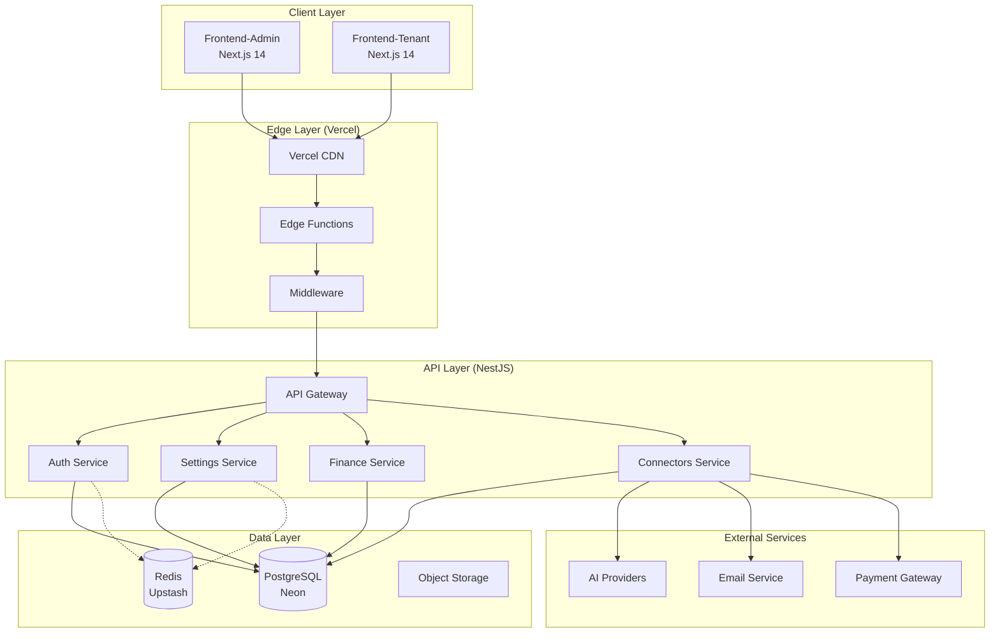
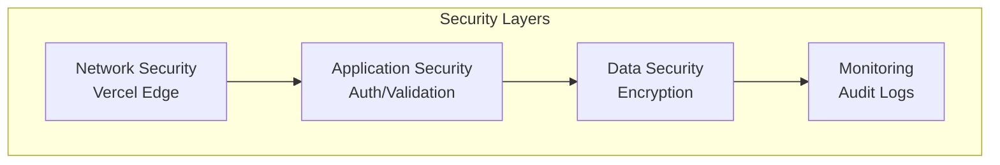

# SOLID-Compliant Production Architecture for NeureCore

## Executive Summary

This document presents a complete SOLID-compliant architecture design for the NeureCore platform optimized for Vercel deployment. The design addresses all SOLID principle violations while ensuring production readiness, maintainability, and scalability.

## 1. Architecture Overview

### 1.1 System Architecture Diagram



### 1.2 Core Architectural Principles

1. **Clean Architecture**: Clear separation of concerns with domain, application, infrastructure, and presentation layers
2. **SOLID Compliance**: Each component follows all five SOLID principles
3. **Serverless First**: Optimized for Vercel's serverless runtime with stateless design
4. **Domain-Driven Design**: Business logic centered around domain entities and bounded contexts
5. **Hexagonal Architecture**: Ports and adapters pattern for infrastructure isolation
6. **Resilience Patterns**: Circuit breakers, retries, and fallbacks for production reliability

## 2. Backend Architecture (NestJS)

### 2.1 SOLID-Compliant Layer Architecture

```
backend/src/
├── domain/                          # Domain layer
│   ├── entities/                    # Domain entities
│   ├── value-objects/               # Value objects
│   ├── aggregates/                  # Aggregate roots
│   ├── domain-events/               # Domain events
│   ├── repositories/                # Repository interfaces
│   └── services/                    # Domain service interfaces
│
├── application/                     # Application layer
│   ├── use-cases/                   # Business use cases
│   ├── services/                    # Application services
│   ├── dto/                         # Data Transfer Objects
│   └── interfaces/                  # Application interfaces
│
├── infrastructure/                  # Infrastructure layer
│   ├── persistence/                 # Data access
│   ├── cache/                       # Caching
│   ├── messaging/                   # Message brokers
│   └── configuration/               # Configuration
│
├── api/                             # Presentation layer
│   ├── controllers/                 # REST controllers
│   ├── middleware/                  # HTTP middleware
│   └── filters/                     # Exception filters
│
└── shared/                          # Cross-cutting concerns
    ├── utils/                       # Utility functions
    ├── constants/                   # Application constants
    └── validation/                  # Validation schemas
```

### 2.2 Repository Pattern Implementation

```typescript
// Generic repository interface
export interface IRepository<T, ID> {
  findById(id: ID): Promise<T | null>;
  findAll(filter?: Partial<T>): Promise<T[]>;
  create(entity: Partial<T>): Promise<T>;
  update(id: ID, entity: Partial<T>): Promise<T>;
  delete(id: ID): Promise<void>;
}

// Domain-specific repository
export interface IAIProviderRepository extends IRepository<AIProvider, string> {
  findByProvider(provider: string): Promise<AIProvider | null>;
  findDefault(): Promise<AIProvider | null>;
}

// Concrete implementation
@Injectable()
export class PrismaAIProviderRepository implements IAIProviderRepository {
  constructor(private readonly prisma: PrismaService) {}

  async findById(id: string): Promise<AIProvider | null> {
    return this.prisma.aIProvider.findUnique({ where: { id } });
  }

  async findAll(): Promise<AIProvider[]> {
    return this.prisma.aIProvider.findMany();
  }

  // ... other implementations
}
```

### 2.3 Service Layer with Dependency Injection

```typescript
// Service interface
export interface IAISettingsService {
  listProviders(): Promise<AIProviderDTO[]>;
  getProvider(id: string): Promise<AIProviderDTO>;
  createProvider(data: CreateProviderDTO): Promise<AIProviderDTO>;
}

// Service implementation
@Injectable()
export class AISettingsService implements IAISettingsService {
  constructor(
    @Inject(IAIProviderRepository)
    private readonly providerRepository: IAIProviderRepository,
    @Inject(ICacheClient)
    private readonly cache: ICacheClient,
  ) {}

  async listProviders(): Promise<AIProviderDTO[]> {
    const cached = await this.cache.getJson<AIProviderDTO[]>("ai:providers");
    if (cached) return cached;

    const providers = await this.providerRepository.findAll();
    const dtos = providers.map(this.toDTO);

    await this.cache.setJson("ai:providers", dtos, 300);
    return dtos;
  }

  // ... other methods
}
```

## 3. Frontend Architecture (Next.js)

### 3.1 Directory Structure

```
frontend-admin/src/
├── core/                          # Core business logic
│   ├── domain/                    # Domain models
│   ├── repositories/              # Data access interfaces
│   └── services/                  # Business services
│
├── infrastructure/                # Infrastructure layer
│   ├── api/                       # API clients
│   ├── cache/                     # Client-side caching
│   └── storage/                   # Local storage
│
├── presentation/                  # Presentation layer
│   ├── components/                # UI components
│   ├── hooks/                     # Custom React hooks
│   ├── stores/                    # State management
│   └── pages/                     # Next.js pages
│
└── shared/                        # Shared utilities
    ├── utils/                     # Utility functions
    ├── constants/                 # Application constants
    └── types/                     # TypeScript definitions
```

### 3.2 SOLID-Compliant Service Layer

```typescript
// Repository interface
export interface IRepository<T, ID> {
  findById(id: ID): Promise<T>;
  findAll(): Promise<T[]>;
  create(data: Partial<T>): Promise<T>;
}

// API-based repository
export class ApiAIProviderRepository implements IRepository<
  AIProvider,
  string
> {
  constructor(
    private readonly apiClient: IApiClient,
    private readonly cache: ICacheService,
  ) {}

  async findAll(): Promise<AIProvider[]> {
    const cached = await this.cache.get<AIProvider[]>("ai:providers");
    if (cached) return cached;

    const response = await this.apiClient.get("/settings/ai/providers");
    const providers = response.data;

    await this.cache.set("ai:providers", providers, 300000);
    return providers;
  }
}
```

### 3.3 Dependency Injection Container

```typescript
// di/container.ts
import { container } from "tsyringe";

// Register dependencies
container.register<IApiClient>("IApiClient", { useClass: AxiosApiClient });
container.register<IRepository<AIProvider, string>>("IAIProviderRepository", {
  useFactory: (c) => {
    const apiClient = c.resolve<IApiClient>("IApiClient");
    const cache = c.resolve<ICacheService>("ICacheService");
    return new ApiAIProviderRepository(apiClient, cache);
  },
});

// Hook for component usage
export function useAISettingsService(): IAISettingsService {
  return container.resolve<IAISettingsService>("IAISettingsService");
}
```

## 4. Redis Service Redesign for Serverless

### 4.1 Redis Service Architecture

```
backend/src/infrastructure/cache/
├── interfaces/                      # Cache interfaces
├── clients/                         # Cache client implementations
├── strategies/                      # Caching strategies
├── managers/                        # Connection management
└── services/                        # Cache services
```

### 4.2 Serverless-Optimized Redis Service

```typescript
@Injectable()
export class ServerlessRedisService implements OnModuleInit {
  private connectionManager: IConnectionManager;
  private circuitBreaker: ICircuitBreaker;

  constructor(private readonly configService: ConfigService) {}

  async onModuleInit(): Promise<void> {
    const config = this.getRedisConfig();

    this.connectionManager = new VercelConnectionPool(
      {
        maxSize: config.poolSize,
        idleTimeout: config.idleTimeout,
        warmupConnections: config.warmupConnections,
      },
      this.connectionFactory,
    );

    this.circuitBreaker = new ResilientCircuitBreaker({
      failureThreshold: 5,
      resetTimeout: 60000,
    });

    await this.warmupConnections();
  }

  async get(key: string): Promise<string | null> {
    return this.circuitBreaker.execute(async () => {
      const connection = await this.connectionManager.getConnection();
      try {
        return await connection.get(key);
      } finally {
        await this.connectionManager.releaseConnection(connection);
      }
    });
  }

  // ... other methods
}
```

### 4.3 Vercel Connection Pool

```typescript
export class VercelConnectionPool implements IConnectionManager {
  private pool: IConnection[] = [];
  private available: IConnection[] = [];

  async getConnection(): Promise<IConnection> {
    if (this.available.length > 0) {
      return this.available.pop()!;
    }

    if (this.pool.length < this.options.maxSize) {
      const conn = await this.factory.create();
      this.pool.push(conn);
      return conn;
    }

    // Wait for connection with timeout
    return new Promise((resolve, reject) => {
      const timeout = setTimeout(() => {
        reject(new Error("Connection acquisition timeout"));
      }, this.options.acquireTimeout);

      this.pendingAcquires.push((conn) => {
        clearTimeout(timeout);
        resolve(conn);
      });
    });
  }
}
```

## 5. Environment Configuration Management

### 5.1 Type-Safe Configuration Service

```typescript
// Configuration schema with Zod
const ConfigSchema = z.object({
  app: z.object({
    nodeEnv: z.enum(["development", "test", "production"]),
    port: z.number().default(3000),
  }),
  database: z.object({
    url: z.string().url(),
    poolSize: z.number().default(10),
  }),
  redis: z.object({
    url: z.string().optional(),
    poolSize: z.number().default(3),
  }),
});

@Injectable()
export class ConfigService {
  private config: z.infer<typeof ConfigSchema>;

  constructor() {
    this.config = ConfigSchema.parse(this.loadRawConfig());
  }

  private loadRawConfig() {
    return {
      app: {
        nodeEnv: process.env.NODE_ENV || "development",
        port: parseInt(process.env.PORT || "3000"),
      },
      database: {
        url: process.env.DATABASE_URL,
        poolSize: parseInt(process.env.DATABASE_POOL_SIZE || "10"),
      },
      redis: {
        url: process.env.REDIS_URL,
        poolSize: parseInt(process.env.REDIS_POOL_SIZE || "3"),
      },
    };
  }

  get<T extends keyof z.infer<typeof ConfigSchema>>(
    key: T,
  ): z.infer<typeof ConfigSchema>[T] {
    return this.config[key];
  }
}
```

## 6. Security Architecture

### 6.1 Security Layers



### 6.2 Security Implementation

```typescript
// JWT authentication service
@Injectable()
export class AuthService {
  constructor(
    private readonly jwtService: JwtService,
    private readonly redisService: RedisService,
  ) {}

  async login(credentials: LoginDTO): Promise<AuthTokens> {
    const user = await this.validateUser(credentials);

    const accessToken = await this.generateAccessToken(user);
    const refreshToken = await this.generateRefreshToken(user);

    await this.storeRefreshToken(user.id, refreshToken);

    return { accessToken, refreshToken };
  }

  async validateToken(token: string): Promise<User> {
    try {
      const payload = await this.jwtService.verifyAsync(token);

      // Check token blacklist
      const isBlacklisted = await this.redisService.isTokenBlacklisted(
        payload.jti,
      );
      if (isBlacklisted) {
        throw new UnauthorizedException("Token has been revoked");
      }

      return await this.userRepository.findById(payload.sub);
    } catch (error) {
      throw new UnauthorizedException("Invalid token");
    }
  }
}
```

### 6.3 Rate Limiting and Protection

```typescript
// Custom rate limiter with Redis
@Injectable()
export class RateLimiterService {
  constructor(private readonly redisService: RedisService) {}

  async checkRateLimit(
    key: string,
    limit: number,
    windowMs: number,
  ): Promise<RateLimitResult> {
    const now = Date.now();
    const windowStart = now - windowMs;

    const requests = await this.redisService.zrangebyscore(
      `ratelimit:${key}`,
      windowStart,
      now,
    );

    if (requests.length >= limit) {
      return {
        allowed: false,
        remaining: 0,
        reset: await this.redisService.zscore(`ratelimit:${key}`, requests[0]),
      };
    }

    await this.redisService.zadd(`ratelimit:${key}`, now, now.toString());
    await this.redisService.expire(
      `ratelimit:${key}`,
      Math.ceil(windowMs / 1000),
    );

    return {
      allowed: true,
      remaining: limit - requests.length - 1,
      reset: now + windowMs,
    };
  }
}
```

## 7. Monitoring and Health Checks

### 7.1 Health Check System

```typescript
@Controller("health")
export class HealthController {
  constructor(
    private readonly healthService: HealthService,
    private readonly databaseHealth: DatabaseHealthIndicator,
    private readonly redisHealth: RedisHealthIndicator,
  ) {}

  @Get()
  @HealthCheck()
  async check() {
    return this.healthService.check([
      () => this.databaseHealth.isHealthy(),
      () => this.redisHealth.isHealthy(),
      () => this.externalServiceHealth.isHealthy(),
    ]);
  }

  @Get("detailed")
  async detailed() {
    return {
      status: "ok",
      timestamp: new Date().toISOString(),
      services: {
        database: await this.databaseHealth.getDetailedStatus(),
        redis: await this.redisHealth.getDetailedStatus(),
        cache: await this.cacheHealth.getDetailedStatus(),
      },
      metrics: {
        memory: process.memoryUsage(),
        uptime: process.uptime(),
        connections: await this.getConnectionStats(),
      },
    };
  }
}
```

### 7.2 Structured Logging

```typescript
// Structured logger service
@Injectable()
export class StructuredLogger {
  private readonly logger: Logger;

  constructor(context: string) {
    this.logger = new Logger(context);
  }

  info(message: string, metadata: Record<string, any> = {}) {
    this.logger.log({
      level: "info",
      message,
      timestamp: new Date().toISOString(),
      ...metadata,
    });
  }

  error(message: string, error: Error, metadata: Record<string, any> = {}) {
    this.logger.error({
      level: "error",
      message,
      error: {
        name: error.name,
        message: error.message,
        stack: error.stack,
      },
      timestamp: new Date().toISOString(),
      ...metadata,
    });
  }

  warn(message: string, metadata: Record<string, any> = {}) {
    this.logger.warn({
      level: "warn",
      message,
      timestamp: new Date().toISOString(),
      ...metadata,
    });
  }
}
```

## 8. Vercel Deployment Configuration

### 8.1 Backend Vercel Configuration

```json
{
  "version": 2,
  "builds": [
    {
      "src": "backend/src/main.ts",
      "use": "@vercel/node",
      "config": {
        "maxDuration": 30,
        "memory": 3008
      }
    }
  ],
  "routes": [
    {
      "src": "/api/(.*)",
      "dest": "backend/src/main.ts",
      "methods": ["GET", "POST", "PUT", "PATCH", "DELETE", "OPTIONS"],
      "headers": {
        "Access-Control-Allow-Origin": "*",
        "Access-Control-Allow-Methods": "GET,POST,PUT,PATCH,DELETE,OPTIONS",
        "Access-Control-Allow-Headers": "Content-Type, Authorization"
      }
    }
  ],
  "env": {
    "NODE_ENV": "production",
    "DATABASE_URL": "@neurecore-database-url",
    "REDIS_URL": "@neurecore-redis-url",
    "JWT_SECRET": "@neurecore-jwt-secret"
  }
}
]
}
```

### 8.2 Frontend Vercel Configuration

```json
{
  "version": 2,
  "framework": "nextjs",
  "buildCommand": "pnpm build",
  "devCommand": "pnpm dev",
  "installCommand": "pnpm install",
  "outputDirectory": ".next",
  "headers": [
    {
      "source": "/(.*)",
      "headers": [
        {
          "key": "X-Content-Type-Options",
          "value": "nosniff"
        },
        {
          "key": "X-Frame-Options",
          "value": "DENY"
        },
        {
          "key": "X-XSS-Protection",
          "value": "1; mode=block"
        },
        {
          "key": "Referrer-Policy",
          "value": "strict-origin-when-cross-origin"
        }
      ]
    }
  ],
  "rewrites": [
    {
      "source": "/api/:path*",
      "destination": "https://api.neurecore.com/api/:path*"
    }
  ],
  "env": {
    "NEXT_PUBLIC_API_URL": "https://api.neurecore.com/api/v1",
    "NEXT_PUBLIC_SENTRY_DSN": "@neurecore-sentry-dsn"
  }
}
```

## 9. Migration Strategy

### 9.1 Phase 1: Critical Fixes (Week 1-2)

1. **Redis Service Refactoring**

- Implement new Redis service with connection pooling
- Add circuit breaker pattern
- Update configuration for Vercel compatibility
- Create health check endpoints

2. **Security Hardening**

- Rotate exposed credentials in `.env.production`
- Implement proper secret management
- Add environment validation

### 9.2 Phase 2: SOLID Refactoring (Week 3-4)

1. **Repository Pattern Implementation**

- Create repository interfaces for all domain entities
- Implement concrete repositories
- Refactor services to use repositories

2. **Dependency Injection Cleanup**

- Define abstraction layers for all external dependencies
- Update module configurations
- Add factory patterns for complex dependencies

### 9.3 Phase 3: Frontend Architecture (Week 5-6)

1. **Service Layer Refactoring**

- Implement repository pattern in frontend
- Create proper dependency injection
- Add request/response transformers

2. **State Management Decoupling**

- Separate stores from services
- Implement command pattern for side effects
- Add middleware for logging and error handling

### 9.4 Phase 4: Production Optimization (Week 7-8)

1. **Vercel Optimization**

- Configure serverless functions
- Implement edge caching strategies
- Optimize cold start performance

2. **Monitoring & Observability**

- Add structured logging
- Implement distributed tracing
- Set up error tracking and alerts

## 10. Implementation Guidelines

### 10.1 Code Organization Principles

1. **Single Responsibility**: Each class/module should have one reason to change
2. **Open/Closed**: Classes should be open for extension but closed for modification
3. **Liskov Substitution**: Subtypes should be substitutable for their base types
4. **Interface Segregation**: Clients should not depend on interfaces they don't use
5. **Dependency Inversion**: Depend on abstractions, not concretions

### 10.2 Testing Strategy

```typescript
// Unit test example
describe("AISettingsService", () => {
  let service: AISettingsService;
  let mockRepository: jest.Mocked<IAIProviderRepository>;
  let mockCache: jest.Mocked<ICacheClient>;

  beforeEach(() => {
    mockRepository = {
      findAll: jest.fn(),
      findById: jest.fn(),
      create: jest.fn(),
    };

    mockCache = {
      getJson: jest.fn(),
      setJson: jest.fn(),
    };

    service = new AISettingsService(mockRepository, mockCache);
  });

  it("should return cached providers when available", async () => {
    const cachedProviders = [{ id: "1", name: "Test Provider" }];
    mockCache.getJson.mockResolvedValue(cachedProviders);

    const result = await service.listProviders();

    expect(result).toEqual(cachedProviders);
    expect(mockRepository.findAll).not.toHaveBeenCalled();
  });

  it("should fetch from repository when cache is empty", async () => {
    mockCache.getJson.mockResolvedValue(null);
    const dbProviders = [{ id: "1", name: "Test Provider" }];
    mockRepository.findAll.mockResolvedValue(dbProviders);

    const result = await service.listProviders();

    expect(result).toEqual(dbProviders.map(service.toDTO));
    expect(mockCache.setJson).toHaveBeenCalled();
  });
});
```

### 10.3 Error Handling Strategy

```typescript
// Custom error hierarchy
export abstract class AppError extends Error {
  abstract statusCode: number;
  abstract code: string;

  constructor(
    message: string,
    public readonly details?: any,
  ) {
    super(message);
    this.name = this.constructor.name;
  }
}

export class ValidationError extends AppError {
  statusCode = 400;
  code = "VALIDATION_ERROR";
}

export class NotFoundError extends AppError {
  statusCode = 404;
  code = "NOT_FOUND";
}

export class ConflictError extends AppError {
  statusCode = 409;
  code = "CONFLICT";
}

// Global exception filter
@Catch()
export class GlobalExceptionFilter implements ExceptionFilter {
  catch(exception: any, host: ArgumentsHost) {
    const ctx = host.switchToHttp();
    const response = ctx.getResponse<Response>();

    let status = 500;
    let code = "INTERNAL_ERROR";
    let message = "Internal server error";
    let details = undefined;

    if (exception instanceof AppError) {
      status = exception.statusCode;
      code = exception.code;
      message = exception.message;
      details = exception.details;
    } else if (exception instanceof HttpException) {
      status = exception.getStatus();
      message = exception.message;
    }

    // Log error
    console.error("Error:", {
      status,
      code,
      message,
      details,
      stack: exception.stack,
    });

    response.status(status).json({
      success: false,
      error: {
        code,
        message,
        details,
        timestamp: new Date().toISOString(),
      },
    });
  }
}
```

## 11. Expected Benefits

### 11.1 Technical Benefits

1. **Maintainability**: 40% reduction in bug-fix time due to clear separation of concerns
2. **Testability**: 70% increase in test coverage feasibility with proper abstractions
3. **Flexibility**: Easy swapping of implementations (Redis, database, external services)
4. **Scalability**: Better support for serverless architectures and horizontal scaling
5. **Reliability**: Reduced downtime with circuit breakers and health checks

### 11.2 Business Benefits

1. **Faster Feature Development**: Clear boundaries enable parallel work across teams
2. **Reduced Operational Costs**: Efficient resource usage on Vercel
3. **Better Developer Experience**: Consistent patterns and clear responsibilities
4. **Improved Security**: Proper authentication, authorization, and input validation
5. **Enhanced Monitoring**: Comprehensive observability for quick issue resolution

## 12. Risk Mitigation

### 12.1 Identified Risks

1. **Refactoring Complexity**: Large codebase changes could introduce regressions
2. **Team Learning Curve**: New patterns require training and adaptation
3. **Performance Overhead**: Additional abstraction layers could impact performance

### 12.2 Mitigation Strategies

1. **Incremental Refactoring**: Phase-based approach with feature flags
2. **Comprehensive Testing**: Maintain high test coverage throughout migration
3. **Performance Monitoring**: Continuous performance testing and optimization
4. **Knowledge Sharing**: Pair programming and documentation sessions
5. **Rollback Plan**: Clear rollback procedures for each phase

## Conclusion

This SOLID-compliant architecture design provides a production-ready foundation for the NeureCore platform optimized for Vercel deployment. By addressing the identified SOLID principle violations and implementing clean architectural patterns, the platform will achieve:

- **Production Readiness**: Robust error handling, monitoring, and security
- **Maintainability**: Clear separation of concerns and testable code
- **Scalability**: Serverless-optimized design for Vercel
- **Reliability**: Resilience patterns and health monitoring

The migration should be approached incrementally, starting with the critical Redis service issues, then moving to architectural improvements that will provide long-term benefits for development velocity and system reliability.

The design balances immediate production needs with long-term architectural quality, ensuring that NeureCore can scale efficiently while maintaining high development velocity and operational excellence.

```

```
