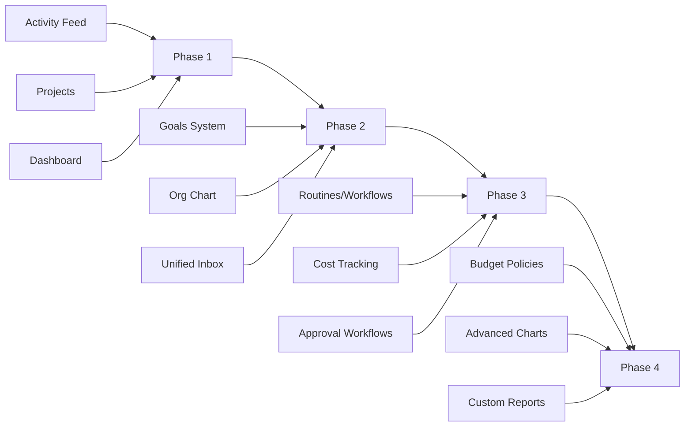

# NeureCore × Paperclip — Feature Adoption Plan

**Date**: March 27, 2026  
**Status**: Planning  
**Inspired by**: [Paperclip](https://paperclip.ing/#get-started) + [GitHub](https://github.com/paperclipai/paperclip)

---

## Executive Summary

Paperclip is an AI agent management platform that excels at **operational efficiency** through structured goal hierarchies, automated workflows, unified inboxes, and comprehensive cost tracking. NeureCore can adopt these patterns to help tenant company owners **run their organizations more efficiently** through specialized AI agents.

---

## Paperclip's Best Features for NeureCore

### Feature Matrix

| Paperclip Feature                            | NeureCore Benefit                            | Complexity |
| -------------------------------------------- | -------------------------------------------- | ---------- |
| [Goals System](#1-goals-system)              | OKR-style hierarchical objectives for agents | Medium     |
| [Routines/Workflows](#2-routines--workflows) | Scheduled + triggered automated tasks        | High       |
| [Unified Inbox](#3-unified-inbox)            | Single action center for all agent outputs   | Medium     |
| [Org Chart](#4-org-chart)                    | Visual hierarchy of departments/agents       | Medium     |
| [Cost Tracking](#5-cost-tracking--budgets)   | Per-agent, per-model spend visibility        | Medium     |
| [Approval Workflows](#6-approval-workflows)  | Human-in-the-loop governance                 | Medium     |
| [Activity Feed](#7-activity-feed)            | Full audit trail for compliance              | Low        |
| [Projects](#8-projects)                      | Work grouping by initiative                  | Low        |
| [Dashboard Metrics](#9-dashboard)            | Real-time KPI cards                          | Low        |

---

## Detailed Feature Specifications

### 1. Goals System

**Paperclip Pattern**: Hierarchical goal trees (parent → child goals) with levels (company, team, individual), statuses, and linked projects.

**NeureCore Adoption**:

```typescript
// New Goal entity
interface Goal {
  id: string;
  tenantId: string;
  title: string;
  description?: string;
  level: "COMPANY" | "DEPARTMENT" | "TEAM" | "INDIVIDUAL";
  status: "ACTIVE" | "COMPLETED" | "PAUSED" | "ARCHIVED";
  parentId?: string; // For hierarchy
  ownerAgentId?: string; // Responsible AI agent
  ownerUserId?: string; // Responsible human
  linkedDepartmentId?: string;
  targetDate?: Date;
  progress?: number; // 0-100
  createdAt: Date;
  updatedAt: Date;
}
```

**Benefits for Tenants**:

- Company owners can set **top-level OKRs** that cascade to departments and agents
- AI agents can have assigned goals they work toward autonomously
- Progress tracking provides **transparency** on organizational objectives

**UI Components Needed**:

- [GoalTree](Temp/paperclip-master/ui/src/components/GoalTree.tsx) - Collapsible tree view
- Goal detail page with inline editing
- Goal creation dialog with parent selector

---

### 2. Routines / Workflows

**Paperclip Pattern**: Scheduled or webhook-triggered automated workflows with cron expressions, concurrency policies, and catch-up strategies.

**NeureCore Adoption**:

```typescript
interface Routine {
  id: string;
  tenantId: string;
  title: string;
  description?: string;
  assigneeAgentId: string; // Which agent executes this
  projectId?: string;
  priority: "LOW" | "MEDIUM" | "HIGH" | "CRITICAL";
  concurrencyPolicy: "COALESCE" | "ALWAYS_ENQUEUE" | "SKIP";
  catchUpPolicy: "SKIP_MISSED" | "CATCH_UP_CAPPED";
  status: "ACTIVE" | "PAUSED" | "ARCHIVED";
  triggers: RoutineTrigger[];
  createdAt: Date;
}

interface RoutineTrigger {
  id: string;
  routineId: string;
  kind: "SCHEDULE" | "WEBHOOK" | "EVENT";
  cronExpression?: string; // e.g., "0 9 * * MON-FRI"
  webhookUrl?: string;
  webhookSecret?: string;
  signingMode?: "BEARER" | "HMAC_SHA256";
  replayWindowSec?: number;
  nextRunAt?: Date;
  enabled: boolean;
}
```

**Benefits for Tenants**:

- **Scheduled reports** generated by agents every Monday morning
- **Daily standups** - agents update task status automatically
- **Webhook integrations** - external systems trigger agent workflows
- **Escalation routines** - agents check for overdue items hourly

---

### 3. Unified Inbox

**Paperclip Pattern**: Single notification center aggregating approvals, failed runs, mentions, and join requests with unread tracking and swipe actions.

**NeureCore Adoption**:

```typescript
interface InboxItem {
  id: string;
  tenantId: string;
  userId: string; // Owner of this inbox
  kind: "APPROVAL" | "FAILED_TASK" | "AGENT_ALERT" | "MENTION" | "BUDGET_ALERT";
  entityType: string; // e.g., "Task", "Approval"
  entityId: string;
  title: string;
  body: string;
  status: "UNREAD" | "READ" | "ARCHIVED" | "DISMISSED";
  priority: "LOW" | "MEDIUM" | "HIGH" | "URGENT";
  createdAt: Date;
  readAt?: Date;
  archivedAt?: Date;
}

interface InboxBadge {
  inbox: number;
  approvals: number;
  failedTasks: number;
  alerts: number;
}
```

**Benefits for Tenants**:

- Company owners get **one place** to see all agent outputs requiring attention
- Failed tasks surface immediately for quick retry/dismissal
- Budget alerts prevent surprise invoices
- **Swipe to archive** for quick triage

**UI Components Needed**:

- [Inbox](Temp/paperclip-master/ui/src/pages/Inbox.tsx) - Full inbox page
- Badge counter in sidebar
- Real-time updates via WebSocket

---

### 4. Org Chart

**Paperclip Pattern**: Visual tree layout of agents showing reporting relationships with pan/zoom.

**NeureCore Adoption**:

```typescript
interface OrgNode {
  id: string;
  name: string;
  role: string;
  status: AgentStatus;
  departmentId: string;
  parentDepartmentId?: string; // For hierarchy
  reports: OrgNode[]; // Children
  agentCount: number;
}
```

**Benefits for Tenants**:

- Visual overview of **department structure**
- See which agents report to which managers
- Pan/zoom for large organizations
- Download as image for documentation

**UI Components Needed**:

- [OrgChart](Temp/paperclip-master/ui/src/pages/OrgChart.tsx) - SVG-based tree
- Department hierarchy computed from existing structure

---

### 5. Cost Tracking & Budgets

**Paperclip Pattern**: Per-provider, per-model cost breakdown with budget policies and quota alerts.

**NeureCore Adoption**:

```typescript
interface CostRecord {
  id: string;
  tenantId: string;
  agentId?: string;
  departmentId?: string;
  provider: "OPENAI" | "ANTHROPIC" | "GOOGLE" | "MISTRAL";
  model: string;
  inputTokens: number;
  outputTokens: number;
  costCents: number;
  windowStart: Date;
  windowEnd: Date;
}

interface BudgetPolicy {
  id: string;
  tenantId: string;
  name: string;
  limitCents: number;
  period: "DAILY" | "WEEKLY" | "MONTHLY";
  scope: "TENANT" | "DEPARTMENT" | "AGENT" | "MODEL";
  scopeId?: string;
  alertThresholds: number[]; // e.g., [50, 75, 90]
  action: "ALERT" | "BLOCK" | "DEGRADE";
  enabled: boolean;
}

interface BudgetIncident {
  id: string;
  tenantId: string;
  budgetPolicyId: string;
  threshold: number;
  totalCents: number;
  status: "ACTIVE" | "ACKNOWLEDGED" | "RESOLVED";
  createdAt: Date;
}
```

**Benefits for Tenants**:

- See exactly **which agents cost how much**
- Set **spending caps** per department to prevent runaway bills
- **Quota alerts** via inbox when approaching limits
- Compare costs across AI providers/models

---

### 6. Approval Workflows

**Paperclip Pattern**: Human-in-the-loop for sensitive agent actions with approve/reject/revision flow.

**NeureCore Adoption**:

```typescript
interface Approval {
  id: string;
  tenantId: string;
  requestedByAgentId: string;
  requestedByUserId?: string;
  approverUserId: string;
  kind: "AGENT_ACTION" | "DATA_ACCESS" | "BUDGET_SPEND" | "CONFIG_CHANGE";
  title: string;
  description?: string;
  payload: Record<string, unknown>; // Action details
  status:
    | "PENDING"
    | "APPROVED"
    | "REJECTED"
    | "REVISION_REQUESTED"
    | "EXPIRED";
  priority: "LOW" | "MEDIUM" | "HIGH" | "URGENT";
  dueAt?: Date;
  decidedAt?: Date;
  decisionNote?: string;
  createdAt: Date;
}
```

**Benefits for Tenants**:

- **Governance**: Large budget spends require manager approval
- **Compliance**: Access to sensitive data needs sign-off
- **Audit trail**: All approval decisions logged

---

### 7. Activity Feed

**Paperclip Pattern**: Chronological event log of all entity changes (agent created, task completed, etc.).

**NeureCore Adoption**:

```typescript
interface ActivityEvent {
  id: string;
  tenantId: string;
  userId?: string;
  agentId?: string;
  entityType: "AGENT" | "TASK" | "GOAL" | "WORKFLOW" | "DEPARTMENT" | "USER";
  entityId: string;
  action:
    | "CREATED"
    | "UPDATED"
    | "DELETED"
    | "STATUS_CHANGED"
    | "ASSIGNED"
    | "COMPLETED"
    | "FAILED";
  changes?: Record<string, { from: unknown; to: unknown }>;
  metadata?: Record<string, unknown>;
  createdAt: Date;
}
```

**Benefits for Tenants**:

- **Full audit trail** for compliance
- Debug what happened when something goes wrong
- Activity by specific agent or user

---

### 8. Projects

**Paperclip Pattern**: Grouping mechanism for related issues/goals with target dates.

**NeureCore Adoption**:

```typescript
interface Project {
  id: string;
  tenantId: string;
  name: string;
  description?: string;
  status: "ACTIVE" | "COMPLETED" | "ARCHIVED";
  goalIds: string[];
  departmentId?: string;
  targetDate?: Date;
  createdAt: Date;
  updatedAt: Date;
}
```

**Benefits for Tenants**:

- Group related **OKRs** under initiatives
- Track **epics** that span multiple agents/tasks
- Filter dashboard by project

---

### 9. Dashboard Metrics

**Paperclip Pattern**: Metric cards with trend indicators, activity charts, and live agent status.

**NeureCore Adoption** (Frontend Tenant Portal Enhancement):

```typescript
interface DashboardMetrics {
  totalAgents: number;
  activeAgents: number;
  tasksCompleted: number;
  tasksInProgress: number;
  tasksFailed: number;
  totalCostThisMonth: number;
  costTrend: number; // Percentage change
  pendingApprovals: number;
  budgetUtilization: number; // Percentage
  agentHealth: {
    healthy: number;
    degraded: number;
    error: number;
  };
}

interface ActivityChartData {
  date: string;
  tasksCompleted: number;
  tasksFailed: number;
  cost: number;
}
```

**Benefits for Tenants**:

- **At-a-glance** organizational health
- Spot trends before they become problems
- Drill down into specific metrics

---

## Implementation Phases



### Phase 1: Foundation (Low Effort, High Impact)

1. **Activity Feed** - Reuse existing audit module
2. **Projects** - Simple grouping entity
3. **Enhanced Dashboard** - Metric cards from existing data

### Phase 2: Organizational Structure

4. **Goals System** - Hierarchical objectives
5. **Org Chart** - Visual department hierarchy
6. **Unified Inbox** - Notification aggregation

### Phase 3: Automation & Governance

7. **Routines/Workflows** - Scheduled + triggered tasks
8. **Cost Tracking** - Per-agent cost records
9. **Approval Workflows** - Human-in-the-loop

### Phase 4: Advanced Controls

10. **Budget Policies** - Spending limits with enforcement
11. **Advanced Charts** - Trend analysis
12. **Custom Reports** - Exportable insights

---

## Technical Considerations

### Backend Changes

- New Prisma models for Goal, Routine, RoutineTrigger, InboxItem, BudgetPolicy
- WebSocket events for real-time inbox updates
- Cron job service for routine execution
- Cost aggregation service

### Frontend Changes

- New pages: Goals, Routines, Inbox, Costs, OrgChart
- Shared components from Paperclip: GoalTree, MetricCard, ActivityCharts
- Real-time badge updates via WebSocket

### Performance

- Index Prisma queries on `tenantId + createdAt` for activity feed
- Use Redis caching for dashboard metrics
- Paginate inbox items (default 50)

---

## Questions for Stakeholder Review

1. Should **Goals** be linked to existing **Departments**, or remain separate?
2. Do tenants need **self-serve budget limits**, or just visibility?
3. Should **Routines** execute within the existing **Task** system or be separate?
4. Which **Approval types** are most critical initially (budget, data access, agent creation)?
5. Should the **Org Chart** show human users, AI agents, or both?

---

## References

- Paperclip UI Source: [`Temp/paperclip-master/ui/src`](Temp/paperclip-master/ui/src)
- Key files examined:
  - [`Dashboard.tsx`](Temp/paperclip-master/ui/src/pages/Dashboard.tsx) - Metrics & activity
  - [`Goals.tsx`](Temp/paperclip-master/ui/src/pages/Goals.tsx) - Goal listing
  - [`Routines.tsx`](Temp/paperclip-master/ui/src/pages/Routines.tsx) - Workflow configuration
  - [`Inbox.tsx`](Temp/paperclip-master/ui/src/pages/Inbox.tsx) - Unified notifications
  - [`OrgChart.tsx`](Temp/paperclip-master/ui/src/pages/OrgChart.tsx) - Visual hierarchy
  - [`Costs.tsx`](Temp/paperclip-master/ui/src/pages/Costs.tsx) - Financial tracking
  - [`Approvals.tsx`](Temp/paperclip-master/ui/src/pages/Approvals.tsx) - Approval workflows
