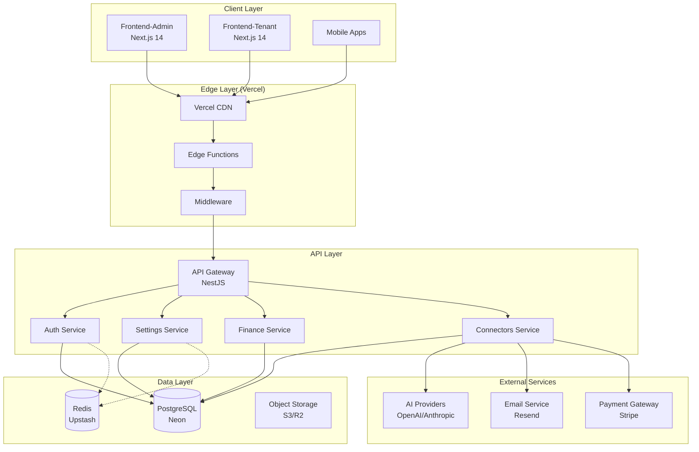

# SOLID-Compliant Production Architecture for NeureCore

## Executive Summary

This document presents a complete SOLID-compliant architecture design for the NeureCore platform, optimized for Vercel deployment. The design addresses all SOLID principle violations identified in the analysis report while ensuring production readiness, maintainability, and scalability.

## 1. Architecture Overview

### 1.1 System Architecture Diagram



### 1.2 Core Architectural Principles

1. **Clean Architecture**: Clear separation of concerns with domain, application, infrastructure, and presentation layers
2. **SOLID Compliance**: Each component follows all five SOLID principles
3. **Serverless First**: Optimized for Vercel's serverless runtime with stateless design
4. **Domain-Driven Design**: Business logic centered around domain entities and bounded contexts
5. **Hexagonal Architecture**: Ports and adapters pattern for infrastructure isolation
6. **Resilience Patterns**: Circuit breakers, retries, and fallbacks for production reliability

## 2. Backend Architecture (NestJS)

### 2.1 SOLID-Compliant Layer Architecture

```
backend/src/
├── domain/                          # Domain layer (business rules)
│   ├── entities/                    # Domain entities
│   ├── value-objects/               # Value objects
│   ├── aggregates/                  # Aggregate roots
│   ├── domain-events/               # Domain events
│   ├── repositories/                # Repository interfaces
│   └── services/                    # Domain service interfaces
│
├── application/                     # Application layer (use cases)
│   ├── use-cases/                   # Business use cases
│   ├── services/                    # Application services
│   ├── dto/                         # Data Transfer Objects
│   ├── commands/                    # Command objects
│   ├── queries/                     # Query objects
│   └── interfaces/                  # Application interfaces
│
├── infrastructure/                  # Infrastructure layer (implementation)
│   ├── persistence/                 # Data access implementations
│   │   ├── repositories/            # Repository implementations
│   │   ├── migrations/              # Database migrations
│   │   └── seeders/                 # Data seeders
│   │
│   ├── cache/                       # Caching implementations
│   │   ├── clients/                 # Cache clients
│   │   ├── strategies/              # Caching strategies
│   │   └── managers/                # Connection managers
│   │
│   ├── messaging/                   # Message brokers
│   ├── external-services/           # External API integrations
│   └── configuration/               # Configuration management
│
├── api/                             # Presentation layer (delivery)
│   ├── controllers/                 # REST controllers
│   ├── middleware/                  # HTTP middleware
│   ├── filters/                     # Exception filters
│   ├── interceptors/                # Response interceptors
│   ├── guards/                      # Auth guards
│   └── decorators/                  # Custom decorators
│
└── shared/                          # Cross-cutting concerns
    ├── utils/                       # Utility functions
    ├── constants/                   # Application constants
    ├── types/                       # TypeScript definitions
    └── validation/                  # Validation schemas
```

### 2.2 Repository Pattern Implementation

#### 2.2.1 Generic Repository Interface

```typescript
// domain/repositories/repository.interface.ts
export interface IRepository<T, ID> {
  findById(id: ID): Promise<T | null>;
  findAll(filter?: Partial<T>): Promise<T[]>;
  findOne(filter: Partial<T>): Promise<T | null>;
  create(entity: Partial<T>): Promise<T>;
  update(id: ID, entity: Partial<T>): Promise<T>;
  delete(id: ID): Promise<void>;
  exists(id: ID): Promise<boolean>;
  count(filter?: Partial<T>): Promise<number>;
}

// Domain-specific repository interface
export interface IAIProviderRepository extends IRepository<AIProvider, string> {
  findByProvider(provider: string): Promise<AIProvider | null>;
  findDefault(): Promise<AIProvider | null>;
  findEnabled(): Promise<AIProvider[]>;
  testConnection(providerId: string): Promise<TestResult>;
}
```

#### 2.2.2 Concrete Repository Implementation

```typescript
// infrastructure/persistence/repositories/prisma-ai-provider.repository.ts
@Injectable()
export class PrismaAIProviderRepository implements IAIProviderRepository {
  constructor(
    private readonly prisma: PrismaService,
    private readonly logger: Logger,
  ) {}

  async findById(id: string): Promise<AIProvider | null> {
    try {
      return await this.prisma.aIProvider.findUnique({
        where: { id },
        include: { models: true },
      });
    } catch (error) {
      this.logger.error(`Failed to find AI provider by ID ${id}:`, error);
      throw new RepositoryError("Failed to find AI provider", error);
    }
  }

  async findAll(filter?: Partial<AIProvider>): Promise<AIProvider[]> {
    try {
      const where = this.buildWhereClause(filter);
      return await this.prisma.aIProvider.findMany({
        where,
        include: { models: true },
        orderBy: { createdAt: "desc" },
      });
    } catch (error) {
      this.logger.error("Failed to find all AI providers:", error);
      throw new RepositoryError("Failed to find AI providers", error);
    }
  }

  private buildWhereClause(filter?: Partial<AIProvider>): any {
    if (!filter) return {};

    const where: any = {};
    if (filter.isEnabled !== undefined) where.isEnabled = filter.isEnabled;
    if (filter.provider) where.provider = filter.provider;

    return where;
  }

  async findByProvider(provider: string): Promise<AIProvider | null> {
    return this.prisma.aIProvider.findFirst({
      where: { provider },
      include: { models: true },
    });
  }

  // ... other implementations
}
```

### 2.3 Service Layer with Dependency Injection

#### 2.3.1 Service Interface

```typescript
// application/services/ai-settings.service.interface.ts
export interface IAISettingsService {
  // Provider management
  listProviders(): Promise<AIProviderDTO[]>;
  getProvider(id: string): Promise<AIProviderDTO>;
  createProvider(data: CreateProviderDTO): Promise<AIProviderDTO>;
  updateProvider(id: string, data: UpdateProviderDTO): Promise<AIProviderDTO>;
  deleteProvider(id: string): Promise<void>;
  setDefaultProvider(id: string): Promise<AIProviderDTO>;
  testProvider(id: string): Promise<TestResultDTO>;

  // Model management
  listModels(providerId?: string): Promise<AIModelDTO[]>;
  addModel(providerId: string, data: CreateModelDTO): Promise<AIModelDTO>;
  updateModel(
    providerId: string,
    modelId: string,
    data: UpdateModelDTO,
  ): Promise<AIModelDTO>;
  deleteModel(providerId: string, modelId: string): Promise<void>;
}
```

#### 2.3.2 Service Implementation

```typescript
// application/services/ai-settings.service.ts
@Injectable()
export class AISettingsService implements IAISettingsService {
  constructor(
    @Inject(IAIProviderRepository)
    private readonly providerRepository: IAIProviderRepository,
    @Inject(IAIModelRepository)
    private readonly modelRepository: IAIModelRepository,
    @Inject(IProviderValidator)
    private readonly providerValidator: IProviderValidator,
    @Inject(IModelValidator)
    private readonly modelValidator: IModelValidator,
    @Inject(ICacheClient)
    private readonly cache: ICacheClient,
    @Inject(INotificationService)
    private readonly notificationService: INotificationService,
    private readonly logger: Logger,
  ) {}

  async listProviders(): Promise<AIProviderDTO[]> {
    const cacheKey = "ai:providers:list";

    try {
      // Check cache first
      const cached = await this.cache.getJson<AIProviderDTO[]>(cacheKey);
      if (cached) {
        this.logger.debug("Returning cached AI providers");
        return cached;
      }

      // Fetch from repository
      const providers = await this.providerRepository.findEnabled();

      // Map to DTOs
      const dtos = providers.map((provider) => this.toProviderDTO(provider));

      // Cache for 5 minutes
      await this.cache.setJson(cacheKey, dtos, 300);

      return dtos;
    } catch (error) {
      this.logger.error("Failed to list AI providers:", error);
      throw new ServiceError("Failed to list AI providers", error);
    }
  }

  async createProvider(data: CreateProviderDTO): Promise<AIProviderDTO> {
    // Validate input
    await this.providerValidator.validateCreate(data);

    // Check for duplicate provider
    const existing = await this.providerRepository.findByProvider(
      data.provider,
    );
    if (existing) {
      throw new ConflictError(`Provider ${data.provider} already exists`);
    }

    try {
      // Create provider
      const provider = await this.providerRepository.create({
        ...data,
        isEnabled: true,
        isDefault: false,
      });

      // Invalidate cache
      await this.cache.delete("ai:providers:list");

      // Notify about creation
      await this.notificationService.publish("ai.provider.created", {
        providerId: provider.id,
        provider: provider.provider,
      });

      return this.toProviderDTO(provider);
    } catch (error) {
      this.logger.error("Failed to create AI provider:", error);
      throw new ServiceError("Failed to create AI provider", error);
    }
  }

  private toProviderDTO(provider: AIProvider): AIProviderDTO {
    return {
      id: provider.id,
      provider: provider.provider,
      name: provider.name,
      apiEndpoint: provider.apiEndpoint,
      isEnabled: provider.isEnabled,
      isDefault: provider.isDefault,
      models: provider.models.map((model) => this.toModelDTO(model)),
      settings: provider.settings,
      createdAt: provider.createdAt.toISOString(),
      updatedAt: provider.updatedAt.toISOString(),
    };
  }

  // ... other methods
}
```

### 2.4 Module Configuration

```typescript
// modules/settings/ai-settings.module.ts
@Module({
  imports: [
    CacheModule.registerAsync({
      useClass: CacheConfigService,
    }),
    DatabaseModule,
    EventModule,
  ],
  controllers: [AISettingsController],
  providers: [
    // Repositories
    {
      provide: IAIProviderRepository,
      useClass: PrismaAIProviderRepository,
    },
    {
      provide: IAIModelRepository,
      useClass: PrismaAIModelRepository,
    },

    // Validators
    {
      provide: IProviderValidator,
      useClass: AIProviderValidator,
    },
    {
      provide: IModelValidator,
      useClass: AIModelValidator,
    },

    // Services
    {
      provide: IAISettingsService,
      useClass: AISettingsService,
    },

    // Cache strategies
    {
      provide: ICacheStrategy,
      useFactory: (config: ConfigService) => {
        return new TTLStrategy(config.get("CACHE_TTL", 300));
      },
      inject: [ConfigService],
    },
  ],
  exports: [IAISettingsService],
})
export class AISettingsModule {}
```

## 3. Redis Service Redesign for Serverless Compatibility

### 3.1 Redis Service Architecture

#### 3.1.1 Directory Structure

```
backend/src/infrastructure/cache/
├── interfaces/                      # Cache interfaces
│   ├── cache-client.interface.ts
│   ├── connection-manager.interface.ts
│   ├── circuit-breaker.interface.ts
│   └── retry-strategy.interface.ts
│
├── clients/                         # Cache client implementations
│   ├── redis-client.ts              # Standard Redis client
│   ├── upstash-client.ts            # Upstash-specific client
│   ├── memory-client.ts             # In-memory client (fallback)
│   └── multi-level-client.ts        # Multi-level cache
│
├── strategies/                      # Caching strategies
│   ├── ttl-strategy.ts              # TTL-based caching
│   ├── lru-strategy.ts              # LRU eviction
│   └── circuit-breaker-strategy.ts  # Circuit breaker pattern
│
├── managers/                        # Connection management
│   ├── connection-pool.ts           # Connection pooling
│   ├── health-manager.ts            # Health checks
│   └── connection-factory.ts        # Connection factory
│
└── services/                        # Cache services
    ├── redis.service.ts             # Main Redis service
    ├── token-blacklist.service.ts   # JWT blacklisting
    └── cache-warming.service.ts     # Cache warming
```

#### 3.1.2 Core Interfaces

```typescript
// interfaces/cache-client.interface.ts
export interface ICacheClient {
  // Basic operations
  get(key: string): Promise<string | null>;
  set(key: string, value: string, ttl?: number): Promise<void>;
  del(key: string): Promise<void>;
  exists(key: string): Promise<boolean>;

  // JSON operations
  getJson<T>(key: string): Promise<T | null>;
  setJson<T>(key: string, value: T, ttl?: number): Promise<void>;

  // Hash operations
  hget(key: string, field: string): Promise<string | null>;
  hset(key: string, field: string, value: string): Promise<void>;
  hgetall(key: string): Promise<Record<string, string>>;

  // Set operations
  sadd(key: string, ...members: string[]): Promise<number>;
  smembers(key: string): Promise<string[]>;
  sismember(key: string, member: string): Promise<boolean>;

  // List operations
  lpush(key: string, ...values: string[]): Promise<number>;
  lrange(key: string, start: number, stop: number): Promise<string[]>;

  // Utility
  expire(key: string, seconds: number): Promise<void>;
  ttl(key: string): Promise<number>;
  flushall(): Promise<void>;

  // Connection management
  connect(): Promise<void>;
  disconnect(): Promise<void>;
  ping(): Promise<string>;
}

// interfaces/connection-manager.interface.ts
export interface IConnectionManager {
  getConnection(): Promise<IConnection>;
  releaseConnection(connection: IConnection): Promise<void>;
  healthCheck(): Promise<HealthStatus>;
  closeAll(): Promise<void>;
  getStats(): ConnectionStats;
}

// interfaces/circuit-breaker.interface.ts
export interface ICircuitBreaker {
  execute<T>(operation: () => Promise<T>): Promise<T>;
  getState(): CircuitState;
  reset(): void;
  getMetrics(): CircuitBreakerMetrics;
}
```

#### 3.1.3 Serverless-Optimized Redis Service

```typescript
// services/redis.service.ts
@Injectable()
export class ServerlessRedisService implements OnModuleInit, OnModuleDestroy {
  private readonly logger = new Logger(ServerlessRedisService.name);
  private connectionManager: IConnectionManager;
  private circuitBreaker: ICircuitBreaker;
  private healthChecker: HealthChecker;
  private metricsCollector: MetricsCollector;
  private isInitialized = false;

  constructor(
    private readonly configService: ConfigService,
    @Inject(IConnectionFactory)
    private readonly connectionFactory: IConnectionFactory,
    @Inject(IRetryStrategyFactory)
    private readonly retryStrategyFactory: IRetryStrategyFactory,
    @Inject(IMetricsService)
    private readonly metricsService: IMetricsService,
  ) {}

  async onModuleInit(): Promise<void> {
    await this.initialize();
  }

  private async initialize(): Promise<void> {
    if (this.isInitialized) return;

    const config = this.getRedisConfig();

    // Initialize connection manager with serverless optimizations
    this.connectionManager = new VercelConnectionPool(
      {
        maxSize: config.poolSize,
        maxConnections: config.maxConnections,
        idleTimeout: config.idleTimeout,
        acquireTimeout: config.acquireTimeout,
        warmupConnections: config.warmupConnections,
      },
      this.connectionFactory,
    );

    // Initialize circuit breaker
    this.circuitBreaker = new ResilientCircuitBreaker(
      {
        failureThreshold: config.circuitBreaker.failureThreshold,
        resetTimeout: config.circuitBreaker.resetTimeout,
        halfOpenMaxAttempts: config.circuitBreaker.halfOpenMaxAttempts,
      },
      this.logger,
    );

    // Initialize health checker
```
