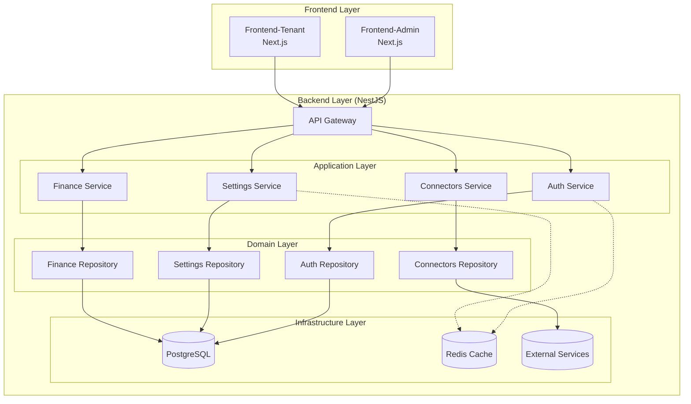
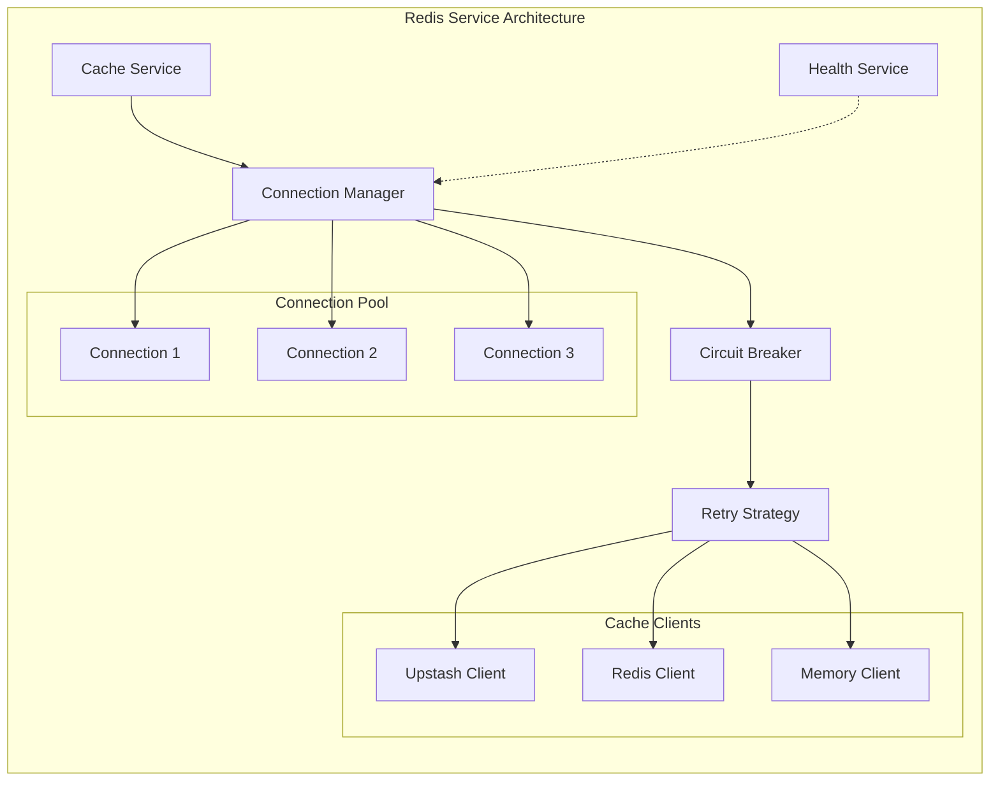

# SOLID-Compliant Architecture Design for NeureCore

## Executive Summary

This document outlines a production-ready, SOLID-compliant architecture for the NeureCore platform (Backend, Frontend-Admin, Frontend-Tenant) optimized for Vercel deployment. The design addresses all SOLID principle violations identified in the analysis report while ensuring serverless compatibility, maintainability, and scalability.

## 1. Architecture Overview

### 1.1 High-Level Architecture Diagram



### 1.2 Core Architectural Principles

1. **Clean Architecture**: Separation of concerns with clear layer boundaries
2. **SOLID Compliance**: Each component follows Single Responsibility, Open/Closed, Liskov Substitution, Interface Segregation, and Dependency Inversion principles
3. **Serverless First**: Optimized for Vercel's serverless runtime with connection pooling and stateless design
4. **Domain-Driven Design**: Business logic centered around domain entities and use cases
5. **Hexagonal Architecture**: Ports and adapters pattern for infrastructure isolation

## 2. Backend Architecture (NestJS)

### 2.1 Directory Structure

```
backend/src/
├── core/                          # Core domain abstractions
│   ├── entities/                  # Domain entities
│   ├── value-objects/             # Value objects
│   ├── aggregates/                # Aggregate roots
│   └── domain-events/             # Domain events
│
├── application/                   # Application layer
│   ├── use-cases/                 # Business use cases
│   ├── services/                  # Application services
│   ├── dto/                       # Data Transfer Objects
│   └── interfaces/                # Application interfaces
│
├── infrastructure/                # Infrastructure layer
│   ├── persistence/               # Data access
│   │   ├── repositories/          # Repository implementations
│   │   ├── migrations/            # Database migrations
│   │   └── seeders/               # Data seeders
│   │
│   ├── cache/                     # Caching layer
│   │   ├── interfaces/            # Cache interfaces
│   │   ├── clients/               # Cache client implementations
│   │   ├── strategies/            # Caching strategies
│   │   └── managers/              # Connection managers
│   │
│   ├── messaging/                 # Message brokers
│   ├── external-services/         # External API integrations
│   └── configuration/             # Configuration management
│
├── api/                           # Presentation layer
│   ├── controllers/               # REST controllers
│   ├── middleware/                # HTTP middleware
│   ├── filters/                   # Exception filters
│   ├── interceptors/              # Response interceptors
│   └── guards/                    # Auth guards
│
├── modules/                       # Feature modules (current structure preserved)
│   ├── settings/                  # Settings module (refactored)
│   ├── auth/                      # Authentication module
│   ├── finance/                   # Finance module
│   └── ...                        # Other modules
│
└── shared/                        # Shared utilities
    ├── decorators/                # Custom decorators
    ├── pipes/                     # Validation pipes
    ├── utils/                     # Utility functions
    └── constants/                 # Application constants
```

### 2.2 SOLID-Compliant Service Layer Design

#### 2.2.1 Repository Pattern Implementation

```typescript
// Core domain interface
export interface IRepository<T, ID> {
  findById(id: ID): Promise<T | null>;
  findAll(filter?: Partial<T>): Promise<T[]>;
  create(entity: Partial<T>): Promise<T>;
  update(id: ID, entity: Partial<T>): Promise<T>;
  delete(id: ID): Promise<void>;
  exists(id: ID): Promise<boolean>;
}

// Domain-specific repository interface
export interface IAIProviderRepository extends IRepository<AIProvider, string> {
  findByProvider(provider: string): Promise<AIProvider | null>;
  findDefault(): Promise<AIProvider | null>;
  testConnection(providerId: string): Promise<TestResult>;
}

// Concrete implementation
@Injectable()
export class PrismaAIProviderRepository implements IAIProviderRepository {
  constructor(private readonly prisma: PrismaService) {}

  async findById(id: string): Promise<AIProvider | null> {
    return this.prisma.aIProvider.findUnique({ where: { id } });
  }

  async findByProvider(provider: string): Promise<AIProvider | null> {
    return this.prisma.aIProvider.findFirst({ where: { provider } });
  }

  // ... other implementations
}
```

#### 2.2.2 Service Layer with Dependency Injection

```typescript
// Service interface
export interface IAISettingsService {
  listProviders(): Promise<AIProviderDTO[]>;
  getProvider(id: string): Promise<AIProviderDTO>;
  createProvider(data: CreateProviderDTO): Promise<AIProviderDTO>;
  updateProvider(id: string, data: UpdateProviderDTO): Promise<AIProviderDTO>;
  testProvider(id: string): Promise<TestResultDTO>;
}

// Service implementation
@Injectable()
export class AISettingsService implements IAISettingsService {
  constructor(
    @Inject(IAIProviderRepository)
    private readonly providerRepository: IAIProviderRepository,
    @Inject(IAIModelRepository)
    private readonly modelRepository: IAIModelRepository,
    @Inject(IProviderValidator)
    private readonly validator: IProviderValidator,
    @Inject(ICacheClient)
    private readonly cache: ICacheClient,
  ) {}

  async listProviders(): Promise<AIProviderDTO[]> {
    // Check cache first
    const cached = await this.cache.getJson<AIProviderDTO[]>("ai:providers");
    if (cached) return cached;

    // Fetch from repository
    const providers = await this.providerRepository.findAll();
    const dtos = providers.map(this.toDTO);

    // Cache for 5 minutes
    await this.cache.setJson("ai:providers", dtos, 300);

    return dtos;
  }

  // ... other methods with proper separation of concerns
}
```

#### 2.2.3 Module Configuration with Dependency Injection

```typescript
@Module({
  imports: [CacheModule, DatabaseModule],
  controllers: [AISettingsController],
  providers: [
    // Repository implementations
    {
      provide: IAIProviderRepository,
      useClass: PrismaAIProviderRepository,
    },
    {
      provide: IAIModelRepository,
      useClass: PrismaAIModelRepository,
    },

    // Service
    AISettingsService,

    // Validators
    {
      provide: IProviderValidator,
      useClass: AIProviderValidator,
    },

    // Cache strategy
    {
      provide: ICacheStrategy,
      useFactory: (config: ConfigService) => {
        return new TTLStrategy(config.get("CACHE_TTL", 300));
      },
      inject: [ConfigService],
    },
  ],
  exports: [IAISettingsService],
})
export class AISettingsModule {}
```

### 2.3 Redis Service Redesign for Serverless Compatibility

#### 2.3.1 Architecture Diagram



#### 2.3.2 Interface Definitions

```typescript
// Core cache interface
export interface ICacheClient {
  get(key: string): Promise<string | null>;
  set(key: string, value: string, ttl?: number): Promise<void>;
  del(key: string): Promise<void>;
  exists(key: string): Promise<boolean>;
  getJson<T>(key: string): Promise<T | null>;
  setJson<T>(key: string, value: T, ttl?: number): Promise<void>;
  disconnect(): Promise<void>;
}

// Connection management interface
export interface IConnectionManager {
  getConnection(): Promise<IConnection>;
  releaseConnection(connection: IConnection): Promise<void>;
  healthCheck(): Promise<HealthStatus>;
  closeAll(): Promise<void>;
}

// Circuit breaker interface
export interface ICircuitBreaker {
  execute<T>(operation: () => Promise<T>): Promise<T>;
  getState(): CircuitState;
  reset(): void;
}

// Retry strategy interface
export interface IRetryStrategy {
  execute<T>(operation: () => Promise<T>): Promise<T>;
}
```

#### 2.3.3 Serverless-Optimized Redis Service

```typescript
@Injectable()
export class ServerlessRedisService implements OnModuleInit, OnModuleDestroy {
  private readonly logger = new Logger(ServerlessRedisService.name);
  private connectionPool: ConnectionPool;
  private circuitBreaker: ICircuitBreaker;
  private healthChecker: HealthChecker;

  constructor(
    private readonly config: ConfigService,
    @Inject(IConnectionFactory)
    private readonly connectionFactory: IConnectionFactory,
    @Inject(IRetryStrategyFactory)
    private readonly retryStrategyFactory: IRetryStrategyFactory,
  ) {}

  async onModuleInit(): Promise<void> {
    const poolSize = this.config.get<number>("REDIS_POOL_SIZE", 3);
    const maxConnections = this.config.get<number>("REDIS_MAX_CONNECTIONS", 10);

    // Initialize connection pool for serverless
    this.connectionPool = new ConnectionPool({
      maxSize: poolSize,
      maxConnections,
      idleTimeout: 30000, // 30 seconds for serverless
      acquireTimeout: 5000,
    });

    // Initialize circuit breaker
    this.circuitBreaker = new ResilientCircuitBreaker({
      failureThreshold: 5,
      resetTimeout: 60000,
      halfOpenMaxAttempts: 3,
    });

    // Initialize health checker
    this.healthChecker = new HealthChecker({
      checkInterval: 30000,
      unhealthyThreshold: 3,
    });

    await this.warmupConnections();
  }

  private async warmupConnections(): Promise<void> {
    // Pre-warm connections for serverless cold starts
    const warmupCount = this.config.get<number>("REDIS_WARMUP_COUNT", 2);
    const promises: Promise<void>[] = [];

    for (let i = 0; i < warmupCount; i++) {
      promises.push(
        this.connectionPool.acquire().then((conn) => conn.release()),
      );
    }

    await Promise.allSettled(promises);
    this.logger.log(`Warmed up ${warmupCount} Redis connections`);
  }

  async get(key: string): Promise<string | null> {
    return this.circuitBreaker.execute(async () => {
      const connection = await this.connectionPool.acquire();
      try {
        return await connection.get(key);
      } finally {
        await this.connectionPool.release(connection);
      }
    });
  }

  async set(key: string, value: string, ttl?: number): Promise<void> {
    return this.circuitBreaker.execute(async () => {
      const connection = await this.connectionPool.acquire();
      try {
        if (ttl) {
          await connection.set(key, value, "EX", ttl);
        } else {
          await connection.set(key, value);
        }
      } finally {
        await this.connectionPool.release(connection);
      }
    });
  }

  // ... other methods with proper error handling and fallbacks
}
```

#### 2.3.4 Connection Pool Implementation for Vercel

```typescript
export class VercelConnectionPool implements IConnectionManager {
  private pool: IConnection[] = [];
  private available: IConnection[] = [];
  private pendingAcquires: Array<(conn: IConnection) => void> = [];
  private isShuttingDown = false;

  constructor(
    private readonly options: PoolOptions,
    private readonly factory: IConnectionFactory,
  ) {}

  async getConnection(): Promise<IConnection> {
    if (this.isShuttingDown) {
      throw new Error("Connection pool is shutting down");
    }

    // Return available connection if exists
    if (this.available.length > 0) {
      return this.available.pop()!;
    }

    // Create new connection if under limit
    if (this.pool.length < this.options.maxSize) {
      const conn = await this.factory.create();
      this.pool.push(conn);
      return conn;
    }

    // Wait for connection to become available (with timeout)
    return new Promise((resolve, reject) => {
      const timeout = setTimeout(() => {
        reject(new Error("Connection acquisition timeout"));
      }, this.options.acquireTimeout);

      this.pendingAcquires.push((conn) => {
        clearTimeout(timeout);
        resolve(conn);
      });
    });
  }

  async releaseConnection(connection: IConnection): Promise<void> {
    // Check if connection is still healthy
    if (!(await connection.isHealthy())) {
      await this.destroyConnection(connection);
      return;
    }

    // Return to available pool or fulfill pending requests
    if (this.pendingAcquires.length > 0) {
      const resolve = this.pendingAcquires.shift()!;
      resolve(connection);
    } else {
      this.available.push(connection);
    }
  }

  private async destroyConnection(connection: IConnection): Promise<void> {
    const index = this.pool.indexOf(connection);
    if (index > -1) {
      this.pool.splice(index, 1);
    }
    await connection.destroy();
  }
}
```

## 3. Frontend Architecture (Next.js)

### 3.1 Directory Structure for Both Admin and Tenant

```
frontend-admin/src/ (and frontend-tenant/src/)
├── core/                          # Core business logic
│   ├── domain/                    # Domain models
│   ├── use-cases/                 # Business use cases
│   ├── repositories/              # Data access interfaces
│   └── services/                  # Business services
│
├── infrastructure/                # Infrastructure layer
│   ├── api/                       # API clients
│   │   ├── clients/               # HTTP client implementations
│   │   ├── interceptors/          # Request/response interceptors
│   │   └── transformers/          # Data transformers
│   │
│   ├── cache/                     # Client-side caching
│   ├── storage/                   # Local/session storage
│   └── config/                    # Configuration
│
├── presentation/                  # Presentation layer
│   ├── components/                # UI components
│   │   ├── ui/                    # Base UI components
│   │   ├── features/              # Feature-specific components
│   │   └── layouts/               # Layout components
│   │
│   ├── hooks/                     # Custom React hooks
│   ├── stores/                    # State management (Zustand)
│   └── pages/                     # Next.js pages
│
├── shared/                        # Shared utilities
│   ├── utils/                     # Utility functions
│   ├── constants/                 # Application constants
│   ├── types/                     # TypeScript definitions
│   └── validation/                # Validation schemas
│
└── di/                           # Dependency injection
    ├── container.ts               # DI container
    ├── providers.ts               # Service providers
    └── tokens.ts                  # Injection tokens
```

### 3.2 SOLID-Compliant Service Layer

#### 3.2.1 Repository Pattern in Frontend

```typescript
// Repository interface
export interface IRepository<T, ID> {
  findById(id: ID): Promise<T>;
  findAll(filter?: Partial<T>): Promise<T[]>;
  create(data: Partial<T>): Promise<T>;
  update(id: ID, data: Partial<T>): Promise<T>;
  delete(id: ID): Promise<void>;
}

// API-based repository implementation
export class ApiAIProviderRepository implements IRepository<AIProvider, string> {
  constructor(
    private readonly apiClient: IApiClient,
    private readonly cache: ICacheService,
  ) {}

  async findAll(): Promise<AIProvider[]> {
    // Check cache first
    const cached = await this.cache.get<AIProvider[]>('ai:providers');
    if (cached) return cached;

    // Fetch from API
    const response = await this.apiClient.get<ApiResponse<AIProvider[]>>(
      '/settings/ai/providers'
    );

    // Transform and cache
    const providers = response.data;
    await this.cache.set('ai:providers', providers, 300000); // 5 minutes

    return providers;
  }

  async
```
