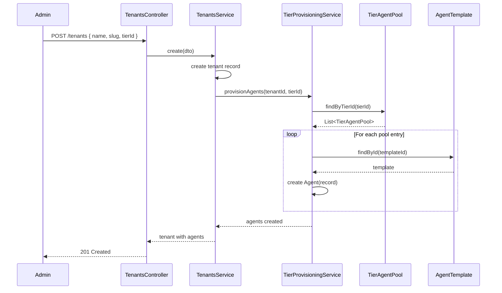

# Tier-Agent Unified Architecture Plan

**Date**: March 29, 2026  
**Status**: Draft for Review  
**Based on Audit**: March 29, 2026 findings

---

## Executive Summary

Currently, NeureCore has two disconnected tier systems and no automatic agent provisioning on tenant creation. This plan unifies the tier system and implements automatic agent deployment based on tier allocation.

### Current Problems

1. **Disconnected Tier Systems**: `TenantPlan` enum (STARTER/GROWTH/PRO/ENTERPRISE) and `TenantTier` objects (Free/Starter/Pro) are not linked
2. **Tier Limits Not Enforced**: `agentLimit` on Tenant defaults to 5, never synced from tier
3. **No Auto-Provisioning**: New tenants get zero agents; must be manually deployed
4. **Tenants Can Create Agents**: Current architecture allows tenant admins to create agents arbitrarily

### Goals

1. Unify tier system (single source of truth in database)
2. Auto-deploy agents from tier's agent pool on tenant creation
3. Tenants can only SELECT from available agents, not create new ones
4. Agent count is FIXED per tier (tenant cannot exceed allocation)
5. Admin/Owner can REPLACE agent configuration but not exceed tier limit

---

## Architecture Design

### 1. Unified Tier System

Replace the file-based `TenantTier` with a database-driven `Tier` model linked to `Tenant`.

```prisma
model Tier {
  id            String   @id @default(uuid())
  name          String   // "Free", "Starter", "Pro", "Enterprise"
  slug          String   @unique // "free", "starter", "pro", "enterprise"
  description   String?
  isActive      Boolean  @default(true)
  isDefault     Boolean  @default(false)
  sortOrder     Int      @default(0)

  // Pricing
  monthlyPrice  Decimal  @default(0)
  yearlyPrice   Decimal  @default(0)
  currency      String   @default("USD")

  // Limits
  maxUsers      Int      @default(2)
  maxAgents     Int      @default(3)
  maxStorageGB  Int      @default(1)
  maxApiCalls   Int      @default(1000)

  // Features flags
  allowCustomBranding  Boolean @default(false)
  allowApiAccess       Boolean @default(false)
  allowSso             Boolean @default(false)
  allowAuditExport     Boolean @default(false)

  // Relations
  tiers: TierAgentPool[]
  tenants: Tenant[]

  createdAt DateTime @default(now())
  updatedAt DateTime @updatedAt
}

model Tenant {
  // ... existing fields ...

  tierId String
  tier   Tier @relation(fields: [tierId], references: [id])

  // Remove old fields (deprecate):
  // - plan: TenantPlan (use tier.slug instead)
  // - agentLimit: Int (use tier.maxAgents instead)
}
```

### 2. TierAgentPool - Available Agents Per Tier

```prisma
model TierAgentPool {
  id         String   @id @default(uuid())
  tierId     String
  tier       Tier     @relation(fields: [tierId], references: [id], onDelete: Cascade)
  templateId String
  template   AgentTemplate @relation(fields: [templateId], references: [id])

  // Slot position in the tier (1 = first available, 2 = second, etc.)
  slot       Int      @default(1)

  // Whether tenant MUST have this agent (true) or it's optional (false)
  isRequired Boolean  @default(false)

  // Default config overrides for this tier
  defaultBudgetPerDay Decimal? @db.Decimal(10, 4)

  createdAt DateTime @default(now())

  @@unique([tierId, templateId])
  @@index([tierId])
}

model Agent {
  // ... existing fields ...

  // Change: tenantId is NOT nullable - agents belong to tenants
  // Remove: templateId (use tierAgentPool relationship instead)

  tierAgentPoolId String?
  tierAgentPool   TierAgentPool? @relation(fields: [tierAgentPoolId], references: [id])

  // Agents are "selected" from pool, not created
  isSelected      Boolean @default(false) // tenant has selected this agent
}
```

### 3. Tenant Creation Flow (Auto-Provisioning)



### 4. Agent Selection vs Creation

**Tenant Admin/Owner Actions:**

- ✅ SELECT agent from pool (mark as `isSelected = true`)
- ✅ REPLACE agent (swap one selected agent for another pool agent)
- ✅ CONFIGURE agent (update name, budgetPerDay, permissions)
- ❌ CREATE new agent (not in pool)
- ❌ EXCEED tier agent limit

**Platform Admin Actions:**

- ✅ All tenant actions
- ✅ Add/remove agents from tier pool
- ✅ Create new agent templates
- ✅ Assign agents to tiers

---

## Implementation Plan

### Phase 1: Database Migration

1. **Create Tier table** in Prisma schema
2. **Update Tenant model** - add `tierId`, remove `plan`, `agentLimit`
3. **Create TierAgentPool table**
4. **Update Agent model** - add `tierAgentPoolId`, `isSelected`
5. **Create TierProvisioningService** (new module)

### Phase 2: Service Layer

1. **TierService** - CRUD for tiers (migrate from SettingsService)
2. **TierProvisioningService** - auto-provision agents on tenant creation
3. **AgentPoolService** - manage tier<->template mappings
4. **Update TenantsService** - integrate tier provisioning

### Phase 3: Controller Changes

1. **SettingsController** - deprecate file-based tier endpoints (keep for migration)
2. **TenantsController** - add `tierId` to create, auto-provision
3. **AgentsController** - restrict tenant-facing endpoints to SELECT/REPLACE only
4. **Remove** direct agent creation endpoints for tenants

### Phase 4: Frontend Changes

1. **Tenant Registration** - show available tiers with agent previews
2. **Agent Selection UI** - checkbox/selector for available agents
3. **Admin Settings** - tier management with agent pool editor
4. **Remove** "Create Agent" button from tenant portal

---

## SOLID Compliance

### Single Responsibility Principle

- `TierService` - only tier CRUD
- `TierProvisioningService` - only agent provisioning logic
- `AgentPoolService` - only pool management
- `TenantsService` - tenant management only (delegates provisioning)

### Open/Closed Principle

- New tier types extend via database records (no code changes)
- Agent templates add without modifying tier logic

### Liskov Substitution Principle

- All tier implementations are interchangeable via `TierService`
- Agent pool entries follow `IAgentPoolEntry` interface

### Interface Segregation

- `ITierService.findAll()` - small, focused
- `IProvisioningService.provisionAgents()` - single purpose
- `IAgentPoolService.getAvailableForTenant()` - dedicated interface

### Dependency Inversion

- `TenantsService` depends on `IProvisioningService` abstraction
- `AgentsController` depends on `IAgentService` abstraction

---

## File Changes Summary

### New Files

```
backend/src/modules/tiers/
├── tiers.module.ts
├── tiers.controller.ts
├── tiers.service.ts
├── tiers.service.spec.ts
├── interfaces/tier.interface.ts
├── interfaces/tier-provisioning.interface.ts
├── interfaces/agent-pool.interface.ts
└── dto/

backend/src/modules/agent-pool/
├── agent-pool.module.ts
├── agent-pool.service.ts
└── agent-pool.service.spec.ts
```

### Modified Files

```
backend/prisma/schema.prisma          - Add Tier, TierAgentPool, modify Tenant/Agent
backend/src/modules/tenants/           - Integrate provisioning
backend/src/modules/agents/           - Restrict tenant creation
backend/src/modules/settings/         - Deprecate tier management
frontend-admin/src/services/          - Add tier management
frontend-tenant/src/                 - Agent selection UI only
```

---

## Migration Strategy

1. **Phase 1**: Add new tables alongside existing (backward compatible)
2. **Phase 2**: Populate Tier table from DEFAULT_TIERS constants
3. **Phase 3**: Backfill existing tenants with default tier
4. **Phase 4**: Enable tier enforcement on new registrations
5. **Phase 5**: Deprecate file-based settings

---

## Next Steps

1. Review and approve this plan
2. Create detailed implementation tasks
3. Begin Phase 1: Database schema design
4. Request mode switch to Code for implementation
